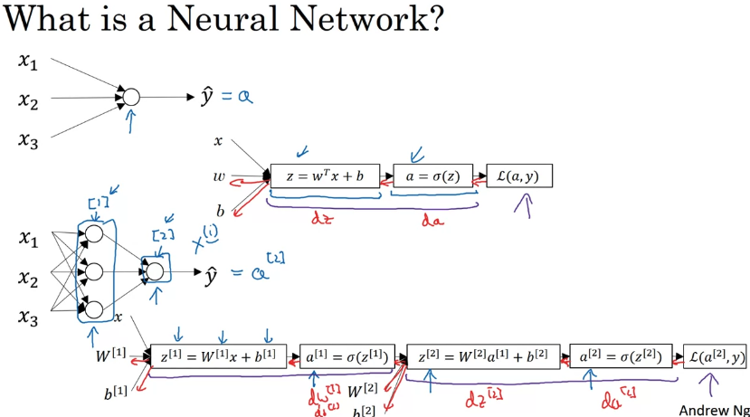
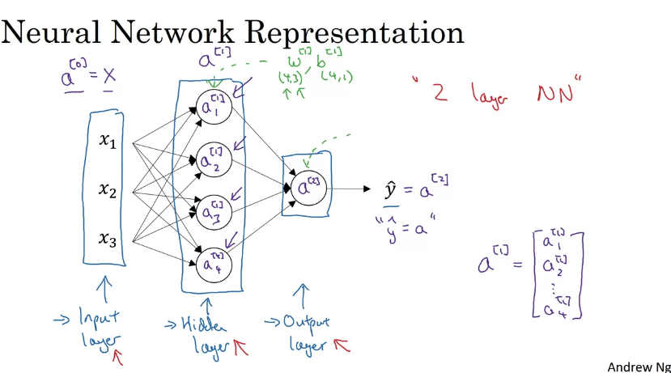
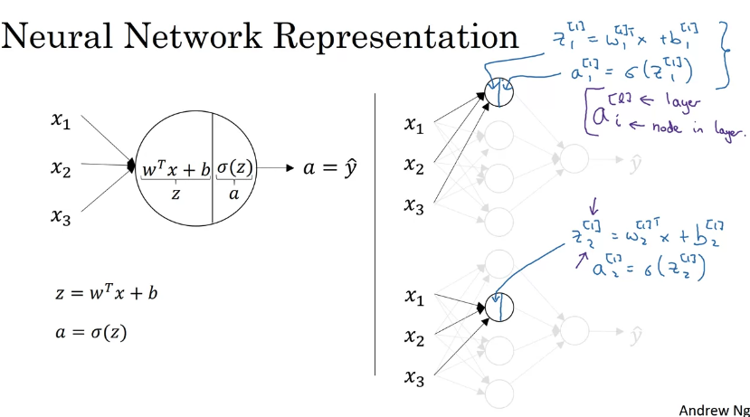
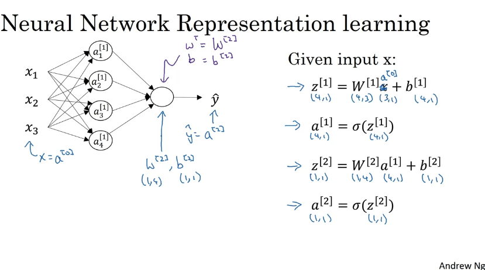
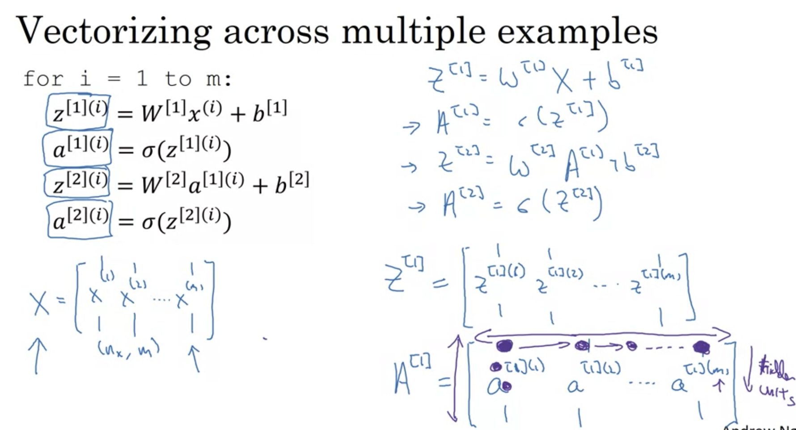

# Week 3

## 1. Neural Networks Overview

  

## 2. Neural Network Representation

### a. Notation

  
  

### b. Matrix transform

+ 对于每一层，z与b的shape一致
+ 对于每一层，w.shape[0] = b.shape[0]，x.shape[1] = b.shape[1]
+ 对于第n层和n+1层，b_n.shape[0] = b_n1.shape[0]

  

## 3. Vectorizing Across Multiple Examples

  

