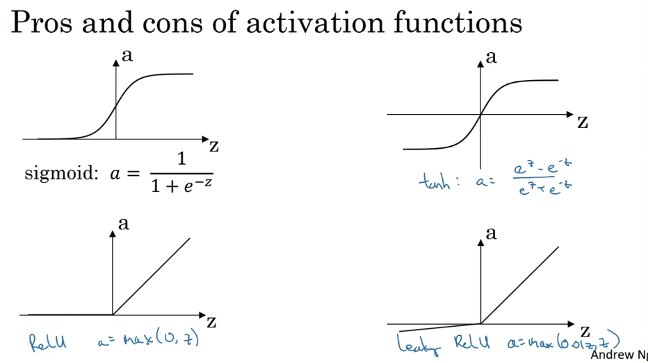
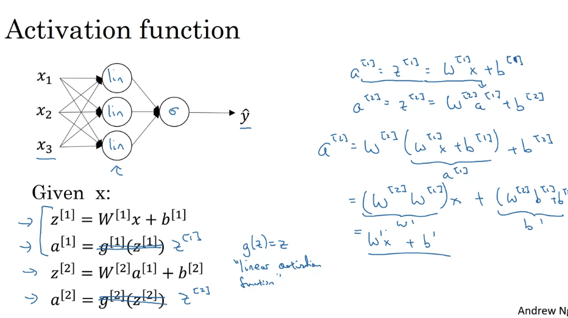
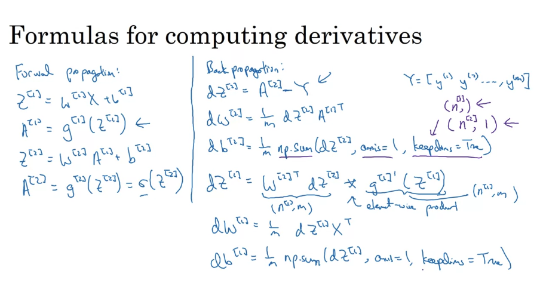
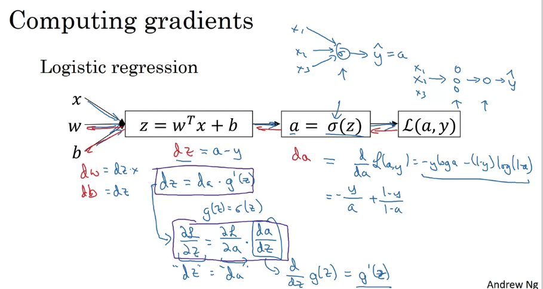

# Week 3

## 1. Neural Networks Overview

<p align="center">
  
</p>

## 2. Neural Network Representation

### a. Notation

<p align="center">
  
  
</p>

### b. Matrix transform

+ 对于每一层，z与b的shape一致
+ 对于每一层，w.shape[0] = b.shape[0]，x.shape[1] = b.shape[1]
+ 对于第n层和n+1层，b_n.shape[0] = b_n1.shape[0]

<p align="center">
  
</p>

## 3. Vectorizing Across Multiple Examples

<p align="center">
  
</p>

## 4. Activation Functions

### a. Activation functions
+ 不管是对于Sigmoid还是tanh function，当z很小或是很大的时候，斜率都会很低，某些程度上降低了gradient descent的速度。
+ 神经网络中每一层的Activation function都可以不一样，通常来说，隐藏层会选择Relu function。
+ 对于Relu来说，当z是负的时候，a = 0。
+ Leaky ReLU是一种变体，当z是负的时候，a不为0.

<p align="center">
  
</p>

### b. Why we need a non-linear activation function?

+ 如果没有activation function或者activation function是linear的，那么y hat的结果只会是input的一个linear的结果。
+ 线性激活函数通常都出现在输出层，隐藏层很少出现

<p align="center">
  
</p>

### c. Derivatives of Activation Functions

#### i. Sigmoid
+ z -> large, g' -> 0
+ z -> small, g' -> 0
+ z = 0, g' = 1/4
+ a = g(z), g' = a(1-a)

#### ii. Tanh 
+ z -> large, g' -> 0
+ z -> small, g' -> 0
+ z = 0, g' = 1
+ a = g(z), g' = 1 - a^2

#### iii. ReLU and Leaky ReLU
+ g1(z) = max(0, z); g2(z) = max(0.01z, z)
+ z < 0, g1'(z) = 0
+ z > 0, g1'(z) = 1
+ z < 0, g2'(z) = 0.01
+ z > 0, g2'(z) = 1

### d. Gradient Descent for Neural Networks

<p align="center">
  
</p>

### e. Backpropagation Intuition

<p align="center">
  
</p>

## 5. Random Initialization

为什么选择0.01？
+ 如果过大（100，1000），梯度下降会非常缓慢
+ 0.01导致神经网络不会包含过多的隐藏层（对于简单神经网络来说是个优势）

```Python
W[1] = np.random.randn((2, 2))*0.01
b[1] = np.zero((2,1))
```