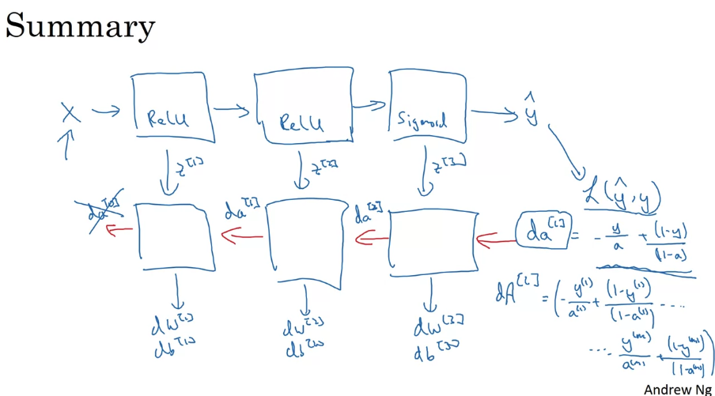

# Week 4

## 1. Deep L-layer Neural Network

### a. Matrix dimensions

+ Z[l]: (n[l], 1)
+ W[l]: (n[l], n[l-1])
+ b[l]: (n[l], 1)
+ dW[l]: W[l]
+ db[l]: b[l]

  
  

### b. Why depp representations

  

### c. Blocks of deep neurak networks

  

### d. Forward and backward propagation

#### i. Forward propagation

  

#### ii. Backward propagation

  

#### iii. Summary

  

## 2. Parameters vs Hyperparameters

Hpyerparamters用于control parameters（Hpyerparamters determine parameters）

+ Parameters: W[1], b[1], W[2], b[2], W[3], b[3], ...
+ Hyperparameters
    + Learning rate: alpha
    + Number of iterations
    + Number of hidden layers: L
    + Number of hidden units: n[1], n[2], n[3], ...
    + Choice of activation function