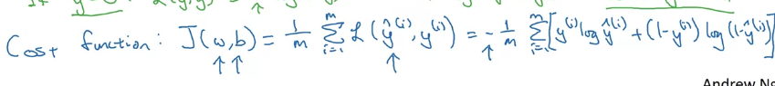
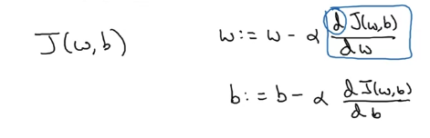
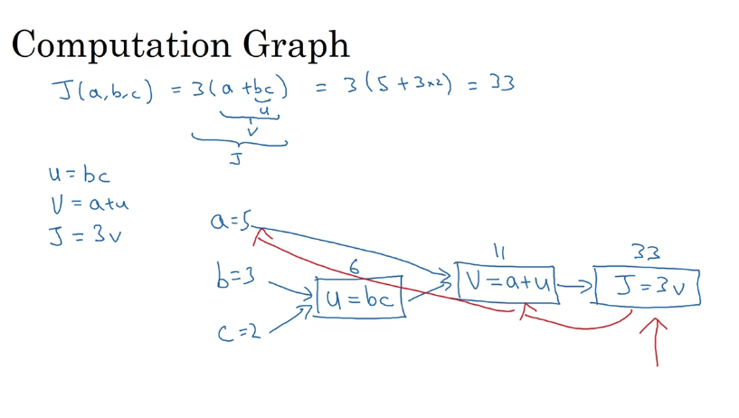

# Week 2

## 1. Binary Classification

### a. Images Store

64 * 64 * 3 -> 12288 * 1

  

### b. Notation

  

## 2. Logistic Regression

### a. 本质
将常规的线性回归公式套入Sigmoid function中，得到Logistic Regression。

  

### b. Logistic Regression cost function

+ 如果使用最小二乘法（1/2(y_hat - y)^2）来作为Logistic Regression的Loss function，会导致梯度下降无法达到Local optimum。
+ 定义Logistic Regression的loss function：

  

+ Cost function：

  

### c. Gradient Descent

Update gradient based on (w, b):

  

## 3. Computation Graph

+ Example

  

+ 相比正向推导，在计算微分的时候，我们会反向来看整个流程（chain rule）

  
  

