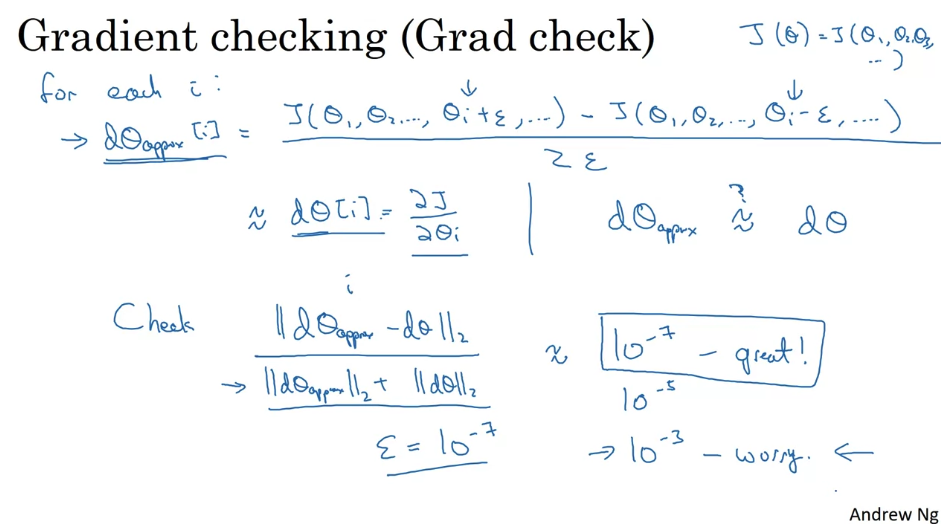

# Week 1

## 1. Setting up

### a. Train/Dev/Test sets

  

### b. Bias/Variance

+ Overfitting: high variance
+ Underfitting: high bias
+ Bias可以看作对training set的描述，bias越低模型越fit数据；Variance可以看作对Dev/test sets的描述，variance越低模型越fit dev/test sets

  
  

### c. Basic Recipe for Machine Learning

+ Bias可以通过改进模型（bigger network）；Variance可以通过增多数据（more data）来改变

  

## 2. Regularization

### a. Introduction

#### i. Logistic regression

通常使用L2 regularization

  

#### ii. Neural network 

Frobenius norm：panel

  

### b. Dropout Regularization

Dropout：每个node会有一定几率drop掉

  

Intuition：分散权重（每层拥有不同权重）
缺点：cost function J is not always well defined (hard to calculate) -> 先关闭drop-out，观察gradient descent是否正常工作，然后再重新训练

  

### c. Other Regularization Methods

#### i. Data augmentation

  

#### ii. Early stopping

在evaluation的图中，绘制training error和dev error；然后stop half way -> 普遍意义上不如L2 regularization

  

## 2. Optimization Problems

### a. Normalizing Inputs

+ Normal training and test sets together
+ normalization可以让gradient descent过程快一些

  
  

### b. Vanishing / Exploding Gradients

梯度爆炸：权重太大/初始值（大于一）有关

  

### c. Weight Initialization for Deep Networks

  

### d. Gradient Checking

#### i. Numerical approximation of gradients

  

#### ii. Gradient check

1. Take W[1], b[1], ... , W[L], b[L] and reshape into a big vector theta.
    + J(W[1], b[1], ... , W[L], b[L]) -> J(theta)
2. Take dW[1], db[1], ... , dW[L], db[L] and reshape into a big vector dtheta.

  

#### iii. Notes

  

