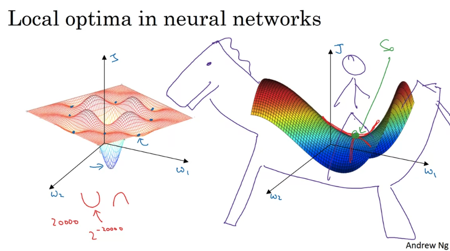

# Week 2

## 1. Mini-batch Gradient Descent

### a. Comparison

Idea: 把大的数据集分为几个大部分，对每个部分进行gradient descent，然后再把前部分graident descent的结果作为后一个部分的输入

  

### b. Mini-batch Gradient Descent

  

### c. Undestanding

在batch gradient descent中，cost在每次iteration的时候都下降；但在mini-batch中，cost应该是波动的

  

+ Stochastic / In-between / Batch comparison
+ How to choose size? -> 
    + 大于2000再使用，一般选择64/512
    + 2的次方数
    + mini-batch不能超过CPU/GPU容量
    + mini-batch也可以作为hyperparameter，通过尝试不同的值来看哪个值让cost function J下降最快

  

## 2. Exponentially Weighted Averages

### a. Implementation

Moving average:
+ V0 = 0
+ V1 = 0.9 * V0 + 0.1 * theta1
+ V2 = 0.9 * V1 + 0.1 * theta2
+ ...
+ Vn = beta * Vt-1 + (1-beta) * thetat

  

+ Legend
    + 红：0.9
    + 绿：0.98
    + 黄：0.5
+ Vt -> an approximate average over 1/(1-beta) days temperature

  
  

### b. Understanding

Why weighted average?

  

### c. Bias Correction

紫线和绿线在后面重合

  

## 3. Gradient Descent with Momentum

目的：让梯度下降变得平滑

  
  

## 4. RMSprop

+ 在垂直方向上震荡更小
+ 可以使用更大的learning rate

  

## 5. Adam Optimization ALgorithm

  
  

## 6. Learning Rate Decay

+ 开始的时候learning rate较大，之后在靠近converge点的时候慢慢减小
+ Hyperparameter: alpha_0

+ epoch -> learning rate
    + 1 -> 0.1
    + 2 -> 0.067
    + 3 -> 0.05
    + 4 -> 0.04

  
  

## 7. The Problem of Local Optima

  
  

