# Week 3

## 1. Hyperparameter Tuning

### a. Tuning Process

Important Hyperparameters: learning rate -> beta, number of hidden units, mini-batch size -> number of layers learning rate decay

+ ry random values: Don't use a grid!
+ Coarse to find

<p align="center">
  
  
</p>

### b. Picking Hyperparameters at Random

+ Random pick的数轴应该是0.0001, 0.001, 0.01这种scale，而不是0～1
+ 因为随着beta趋近于1，其结果对于beta的改变非常敏感；如果beta从0.999变成0.9995，它将会对你正在运行的算法产生巨大的影响；在前一个例子中，都是取大约10个值的平均，但是这里，取指数加权平均的情况下，它从取最后1000个样例变成了取最后2000个样例的平均，因为我们的公式是1/(1-beta)，所以当beta趋近于1时,它对beta的改变非常敏感

<p align="center">
  
  
</p>

### c. Hyperparameters Tuning in Practice: Pandas vs. Caviar

+ Babysitting one model：每天修改一点点
+ Train many models in parallel（有大量计算资源时才可用）

<p align="center">
  
</p>

## 2. Batch Normlaization

### a. Implement Batch Norm

<p align="center">
  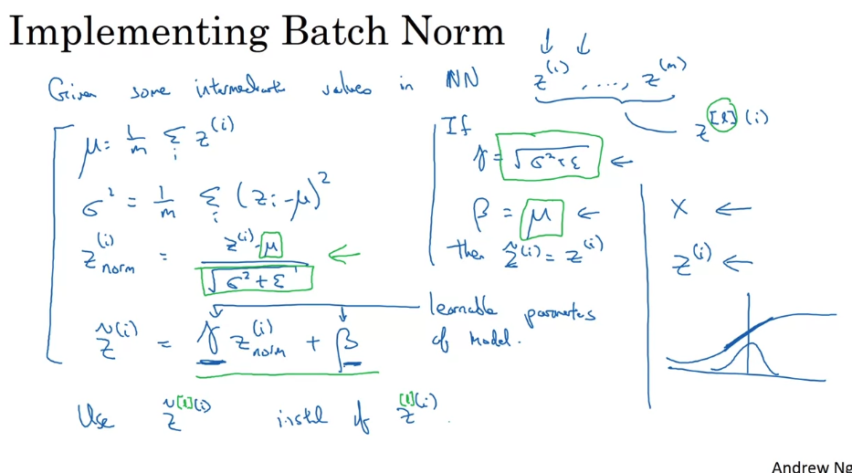
</p>

### b. Fitting into a NN

Basic process:

<p align="center">
  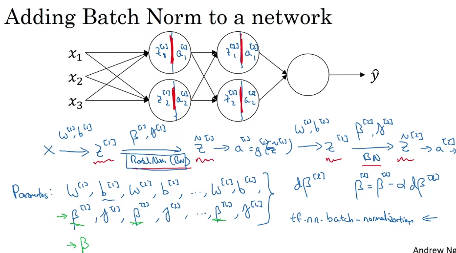
</p>

+ 参数BetaL来决定 (带波浪号的)zL的均值，因为BN算法使层级中各个zL的均值为0，我们就没有理由保留参数bL，所以就把它忽略了相应地被BetaL所代替
+ zL, betaL, gammaL, bL的shape都是(nL, 1)

<p align="center">
  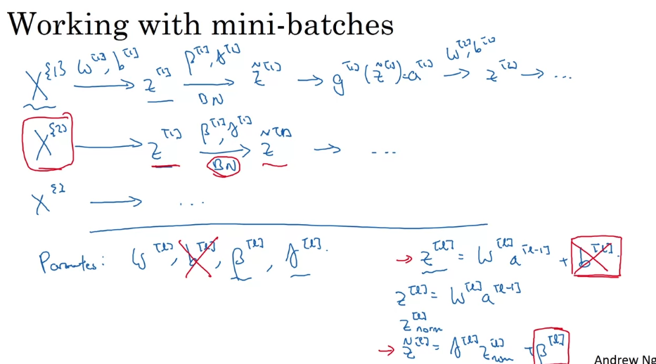
  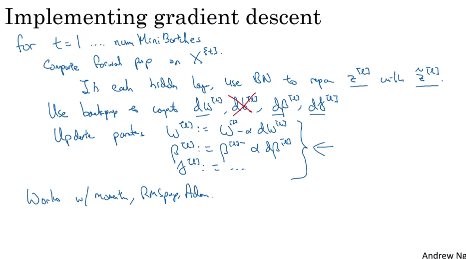
</p>

### c. Why Does Batch Norm Work?

Covariate shift：对猫进行classification，input全部黑猫转换成各种各样的颜色的猫

<p align="center">
  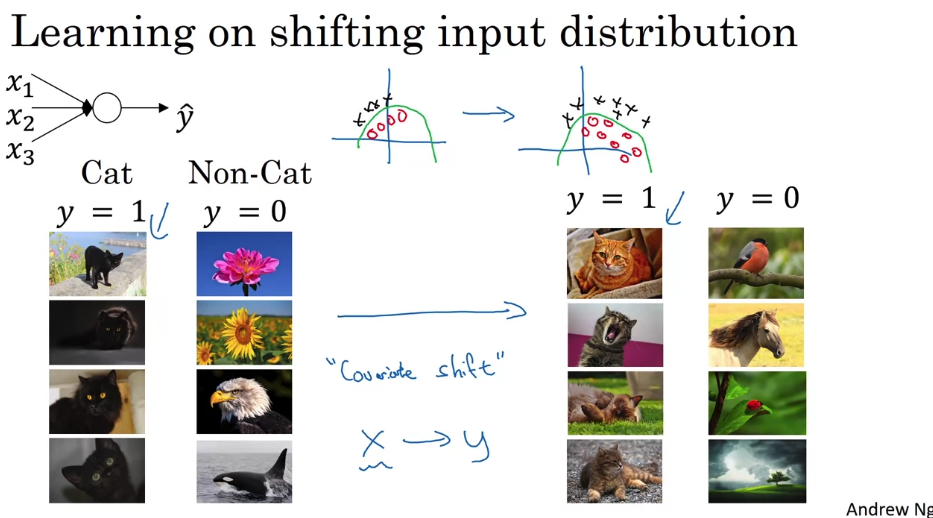
</p>

Z值变化，但mean和variance都不会偏离0和1太多

<p align="center">
  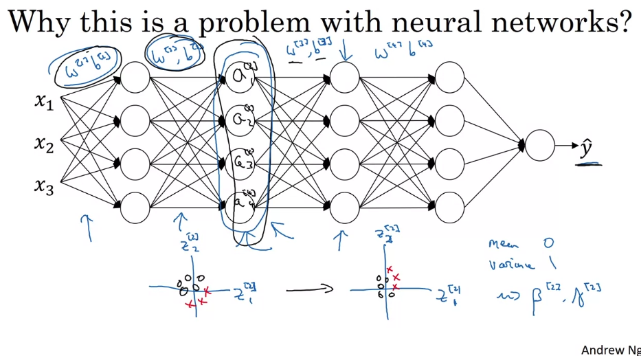
  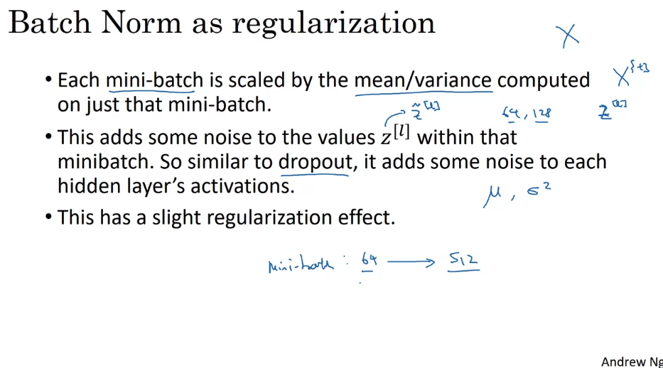
</p>

### d. Batch Norm at Test Time

Test time: 在测试时，我们可能会需要处理单个测试实例，处理的方式就是通过训练集来估算mu和sigma平方。理论上，我们可以用我们最后的网络运行整个训练集来得到mu和sigma平方，但是实际上人们会用某种指数加权平均来记住在训练时见到的mu和sigma平方的值，然后用这个指数加权平均数来得到mu和sigma平方的粗略的估算。然后我们用这些mu和sigma平方的估算值，在测试时进行比例缩放来获取隐藏神经元的Z值 

<p align="center">
  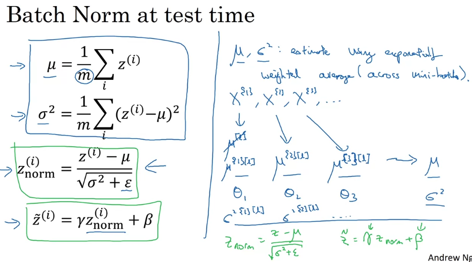
</p>

## 3. Multi-class Classification

### a. Softmax Regression

如果number of class = 4，那么输出层就有四个，每个都是P(class_n|x)的概率

<p align="center">
  
</p>

### b. Training a Softmax Classifier

<p align="center">
  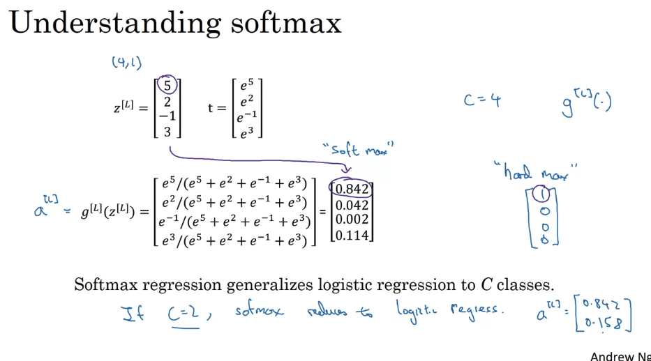
</p>

Implementation:

<p align="center">
  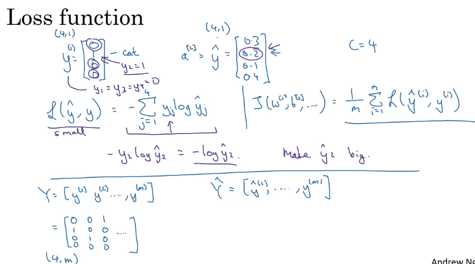
  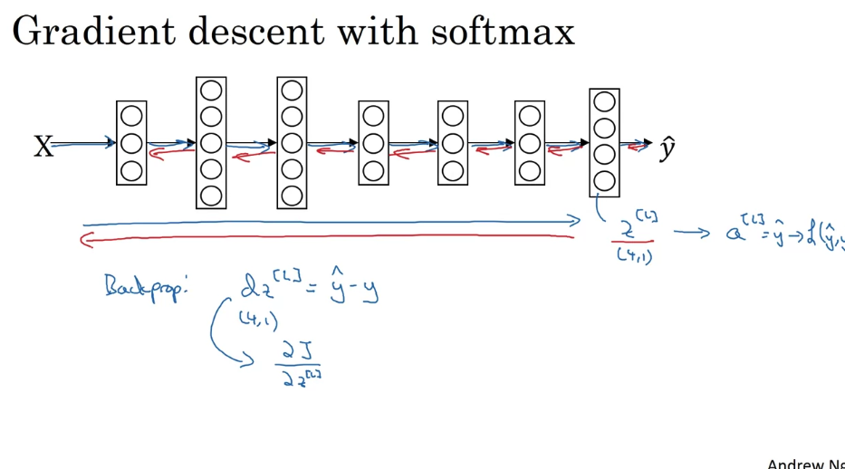
</p>

## 4. Programming Frameworks

### a. Deep Learning Frameworks

<p align="center">
  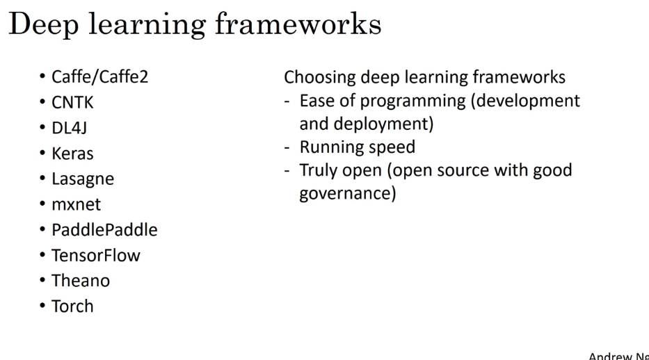
</p>

### b. TensorFlow

#### i. Motivating problem

<p align="center">
  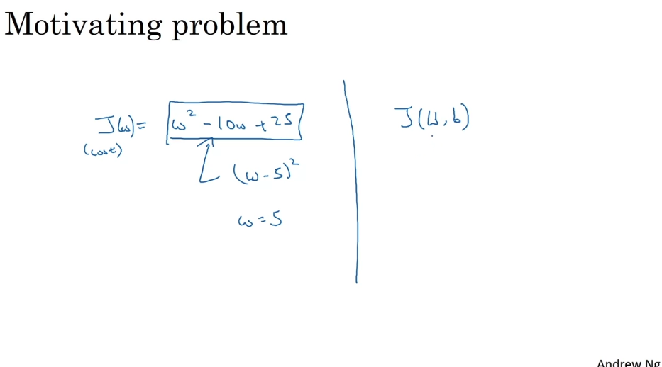
</p>

#### ii. Coding

```Python
import numpy as np
import tensorflow as tf
```

```Python
w = tf.Variable(0, dtype=tf.float32)  # TF float
optimizer = tf.keras.optimizers.Adam(0.1)  # learning_rate = 0.1

def train_step():
  with tf.GradientTape() as tape:  # Record sequency of propagation
    cost = w**2 - 10*w + 25  # 我们只需要输入forward prop，TF会自动完成backward prop
  trainable_variables = [w]
  grads = tap.gradient(cost, trainable_variables)
  optimizer.apply_gradients(zip(grads, trainable_variable))

```

```Python
for i in range(1000):
  train_step()
```

```Python
w = tf.Variable(0, dtype=tf.float32) 
x = np.array([1.0, -10.0, 25.0], dtype=np.float32)
optimizer = tf.keras.optimizers.Adam(0.1)

def training(x, w, optimizer):
  def cost_fn():
    cost = x[0]*w**2 + x[1]*w + x[2]
  for i in range(1000):
    optimizer.minimize(cost_fn, [w])
  
  return w

w = training(x, w, optimizer)
```
