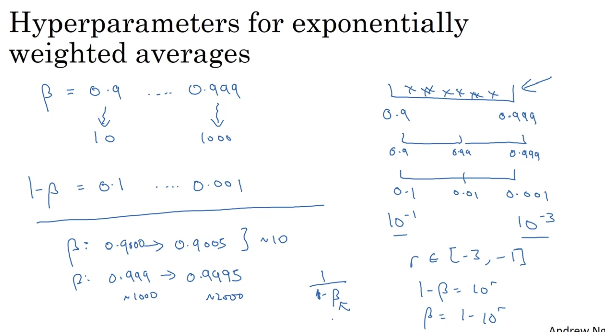

# Week 3

## 1. Hyperparameter Tuning

### a. Tuning Process

Important Hyperparameters: learning rate -> beta, number of hidden units, mini-batch size -> number of layers learning rate decay

+ ry random values: Don't use a grid!
+ Coarse to find

  
  

### b. Picking Hyperparameters at Random

+ Random pick的数轴应该是0.0001, 0.001, 0.01这种scale，而不是0～1
+ 因为随着beta趋近于1，其结果对于beta的改变非常敏感；如果beta从0.999变成0.9995，它将会对你正在运行的算法产生巨大的影响；在前一个例子中，都是取大约10个值的平均，但是这里，取指数加权平均的情况下，它从取最后1000个样例变成了取最后2000个样例的平均，因为我们的公式是1/(1-beta)，所以当beta趋近于1时,它对beta的改变非常敏感

  
  

### c. Hyperparameters Tuning in Practice: Pandas vs. Caviar

+ Babysitting one model：每天修改一点点
+ Train many models in parallel（有大量计算资源时才可用）

  

