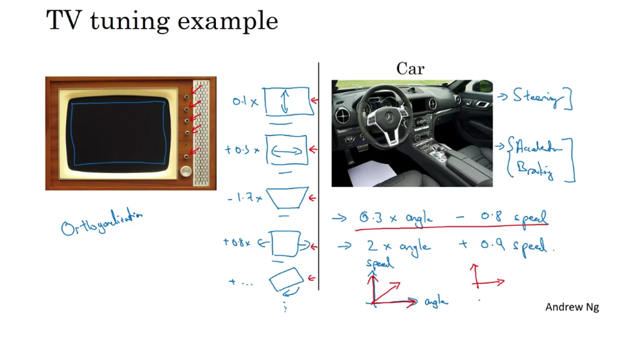
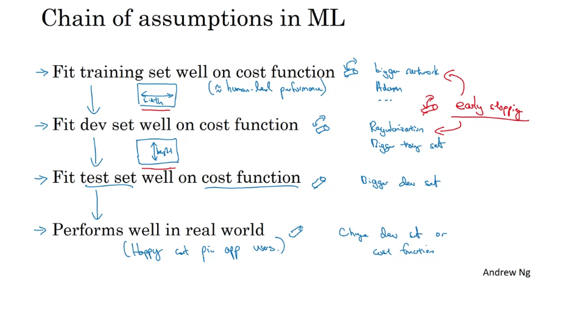
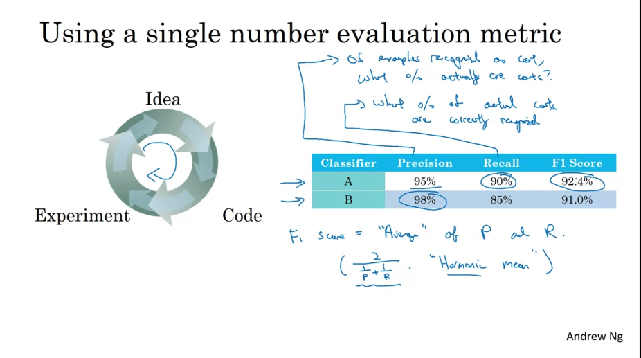
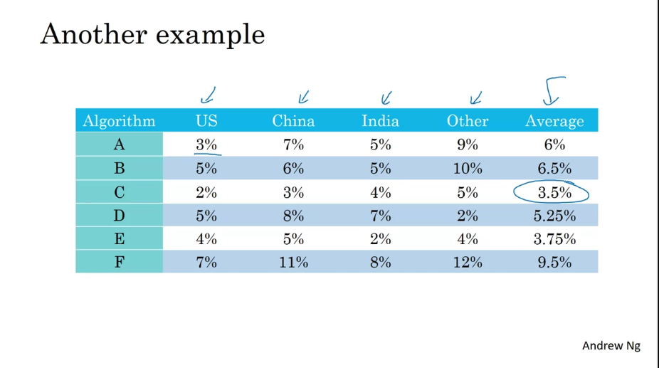
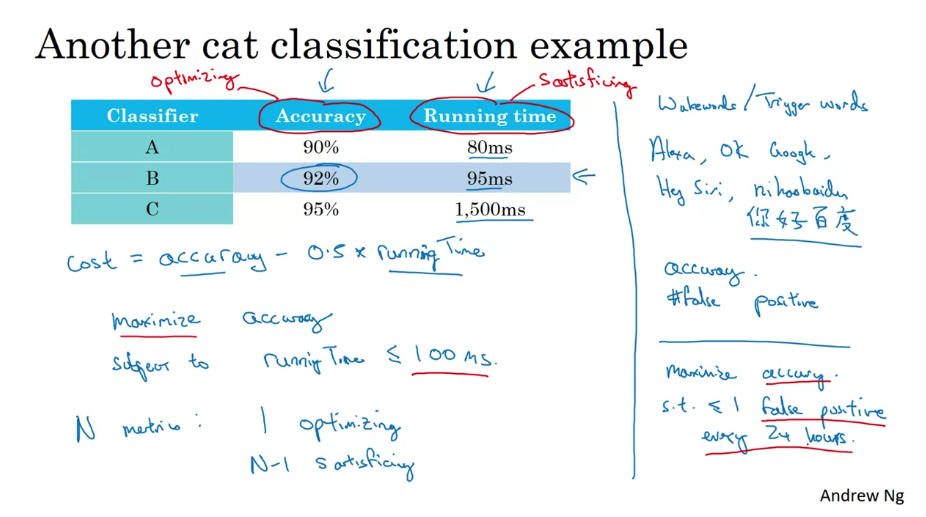
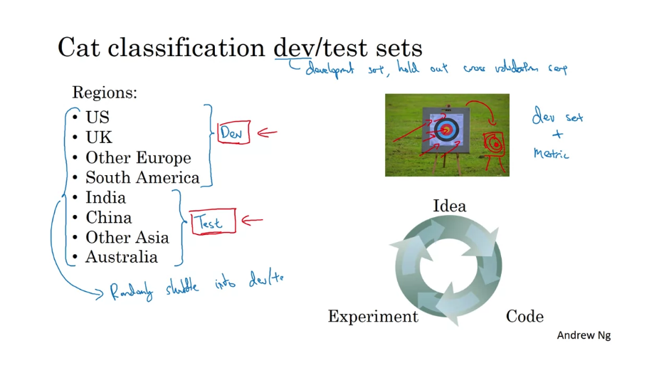
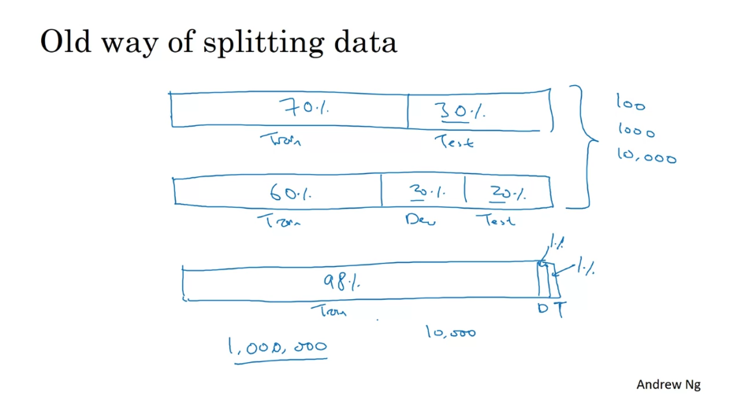
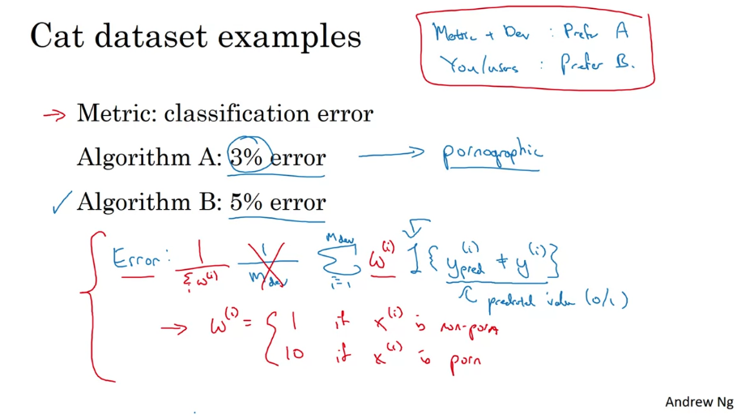
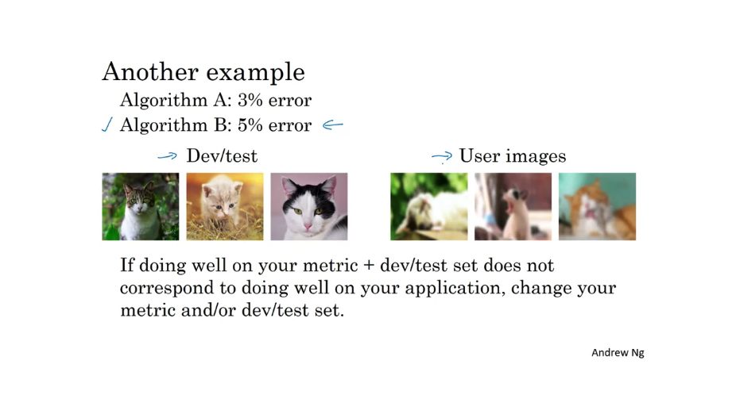

# Week 1

## 1. Orthogonalization

TV tuning example:

  

Chain of assumptions in ML:

  

## 2. Setting Up Your Goal

### a. Single Evaluation Metric

有两个evaluation metrics的时候，快速的找出好的模型会很困难 -> 使用F1分数：2 / (1/P + 1/R)

  

在多种类别的情况下：Compute the average

  

### b. Satisficing and Optimizing Metric

+ Satisficing metric: 锦上添花，比如运行时间
+ Optimizing metric: 雪中送炭，比如模型精确度
+ cost = Sm - b*Om

  

### c. Train/Dev/Test Distributions

+ 选择一个能反应data所有方面部分的数据作为dev set
+ dev set和test set必须要来自于same distribution

  

### d. Splitting data

+ Old way vs. new way
+ Size of test set: set your test set to be big enough to give high confidence in the overall performance of your system

  

### e. When to Change Dev/Test Sets And Metrics?

Example 1: 添加W[i] -> 如果不是porn，那么W[i] = 1；如果是，那么W[i] = 10

  

Example 2: 更清晰的图片和不清晰（用户自己上传的） -> 用户可能更prefer自己上传的模糊图片

  

## 3. Comparing to Human-level Performance

