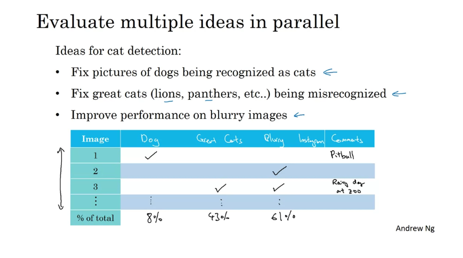
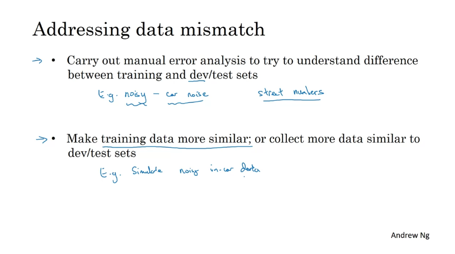

# Week 2

## 1. Error Analysis

### a. Error Analysis

+ Get ~100 mislabeled dev set examples
+ Count up how many are dogs

  
  

### b. Cleaning Up Incorrectly Labeled Data

+ 对于training set来说
    + 如果错误是randomly distributed，那么可以忽略
    + 如果错误不是randomly distributed的，比如一直把白色的狗label为猫，那么问题就比较严重
+ 对于test/dev sets来说
    + 进行error analysis，加一个新的column - incorrectly labeled

  

Correct incorrect dev/test set:

  

### c. Build Your First System

  

## 2. Mismatched Training/Dev/Test sets

### a. Different Distributions

+ 方案一：可以将这些数据集放在一起 这样就有了210,000个图片 然后将这210,000个图片随机混合 得到训练/开发/测试集 为讨论方便 假设你的 开发集和测试集各包含2,500个样例 那么训练集则包含205,000个样例
    + 优点：这样一来你的训练/开发/测试集 都来自于同一分布 易于管理 
    + 缺点：Dev set有2,500个样例 但是大部分来自网页图片的分布 而不是真正需要关心的 来自移动应用图片的分布
+ 方案二：假设训练集仍然包含205,000个图片 所有来源于网络的200,000个图片都放进训练集 如果你想还可以加入来自于移动应用的5,000个图片；开发集和测试集 则不必依照这个比例 你的开发集和测试集将包含所有的移动应用图片 -> 所以训练集包含200,000个网络图片 和5,000个移动应用图片 开发集包含2,500个移动应用图片 测试集也包含2,500个移动应用图片
    + 优点：瞄准了正确的目标
    + 缺点：训练集的分布不同于开发和测试集分布（其实长远来说可能性能更好）

### b. Biased and Variance with Mismatched Data Distribution

  

### c. Addressing Data Mismatch

+ Artificial data synthesis：注意不要只模拟一小部分数据

  

## 3. Learning from Multiple Tasks

### a. Transfer Learning

把问题转换为已经有大量数据的问题然后建模

When transfer learning makes sense:

+ Task A and B have the same input x
+ You have a lot more data for Task A than Task B

### b. Multi-task learning

  
  

When multi-task learning make sense:

  

## 4. End-to-end Deep Learning

### a. Introduction

对于一些数据处理系统或者是由多个阶段组成的学习系统，端到端的深度学习可以它们捕获所有的阶段，并且可以将其替代为单个神经网络 -> 也就是说运行速度更快

Examples

  
  

### b. Discussion

  
  

