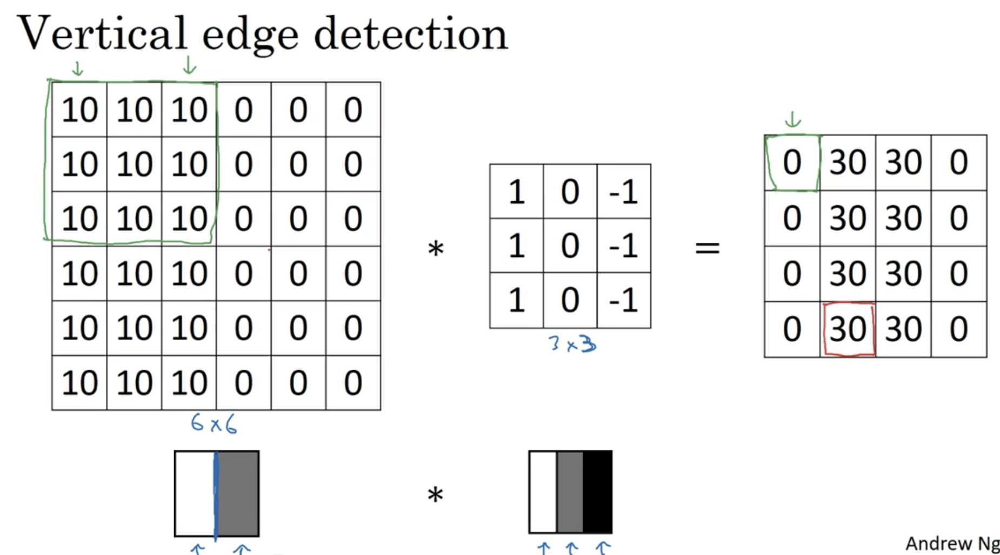
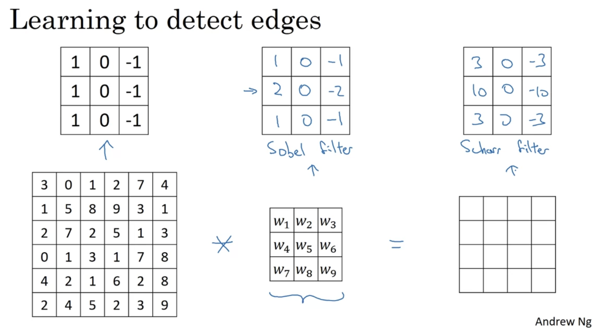
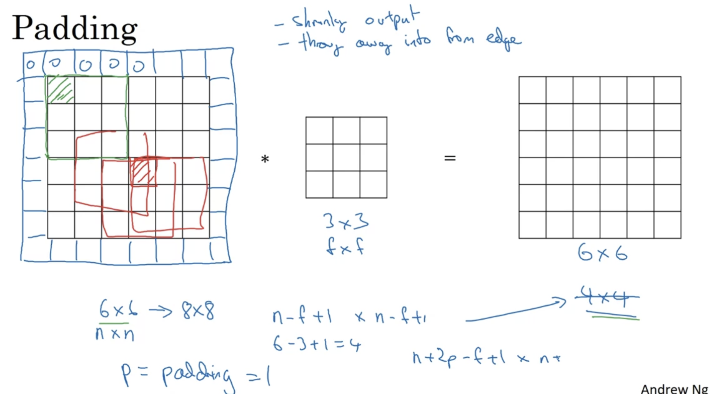
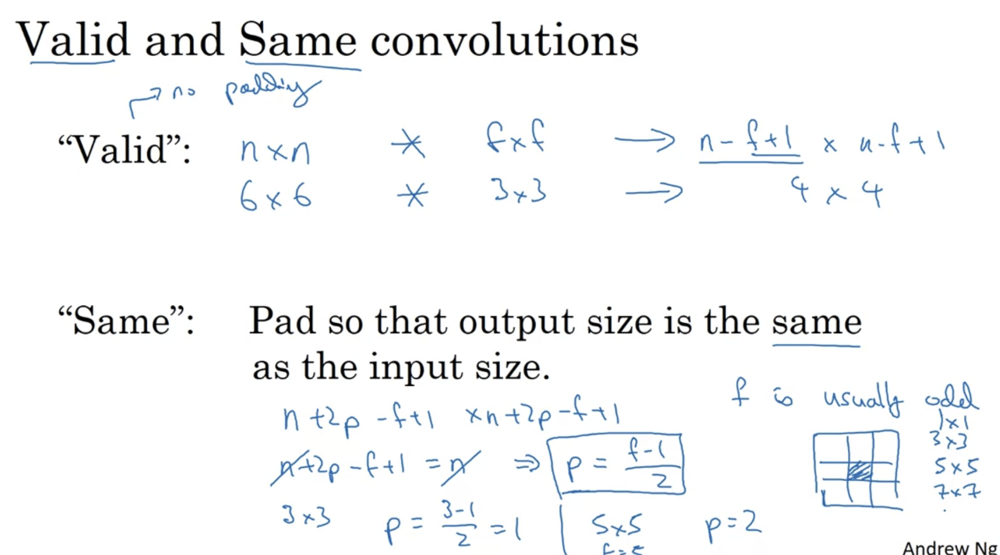

# Week 1

## 1. Computer Vision

### a. Introduction

Image recognition问题：input会变的特别大

### b. Edge Detection Example

+ Python: conv-forward
+ Tensorflow: tf.nn.conv2d
+ keras: Conv2d

  
  

More edge detection

  

### c. Padding

+ 缺点
  + 每使用一次卷积，图像都会变小一点；每次想检测边界或者其他的特征时，都缩小图片
  + 边界上的点每次都只会被使用一次
+ 解决方案
  + 在最外圈增加一圈或n圈

  
  

### d. Strided Convolution