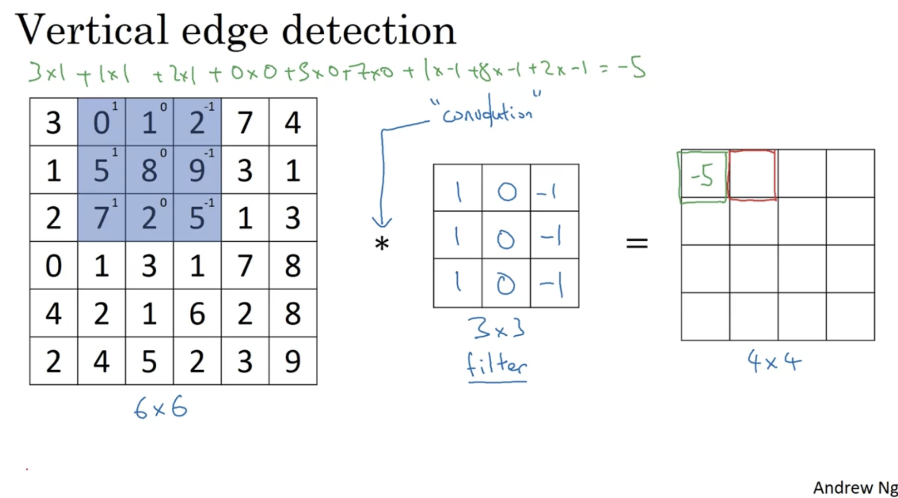

# Week 1

## 1. Computer Vision

### a. Introduction

Image recognition问题：input会变的特别大

### b. Edge Detection Example

+ Python: conv-forward
+ Tensorflow: tf.nn.conv2d
+ keras: Conv2d

  
  

More edge detection

  

## 2. CNN
### a. Padding

+ 缺点
  + 每使用一次卷积，图像都会变小一点；每次想检测边界或者其他的特征时，都缩小图片
  + 边界上的点每次都只会被使用一次
+ 解决方案
  + 在最外圈增加一圈或n圈 -> Padding

  
  

### b. Strided Convolution

Stirde -> 跳步 

  
  

### c. Convolutions over Volume

  

### d. One Layer of a Convolutional Network

If you have 10 filters that are 3*3*3 in one layer of a neural network, hwo many parameters does that layer have? -> 3*3*3+1 = 28; 28*10 = 280

Summary of notation:

  

Example of ConvNet:

+ Convolution (CONV)
+ Pooling (POOL)
+ Fully connected (FC)

  

### e. Pooling Layers

#### i. Max pooling

No parameters to learn

  
  

#### ii. Average pooling

  

#### iii. Summary

  

### f. CNN Example

  

Shape:

  

### g. Why Convolutions?

1. Parameter sharing
2. Sparsity of connections

  

