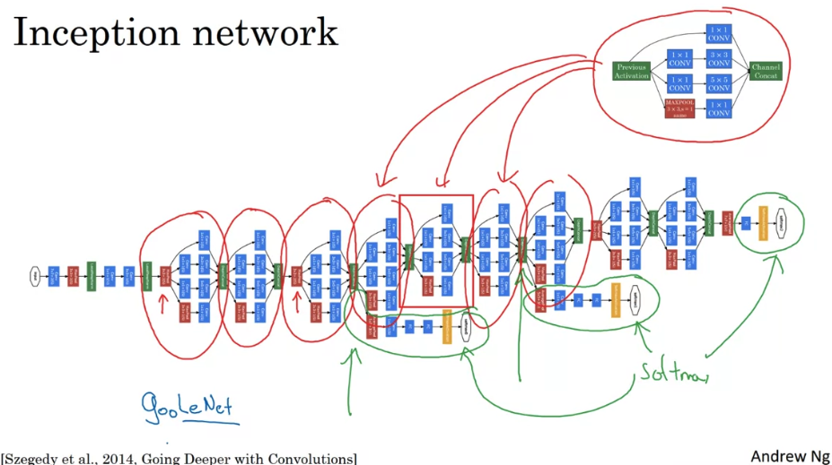
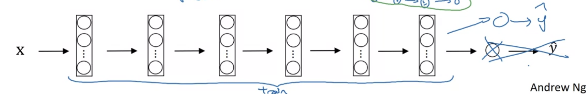
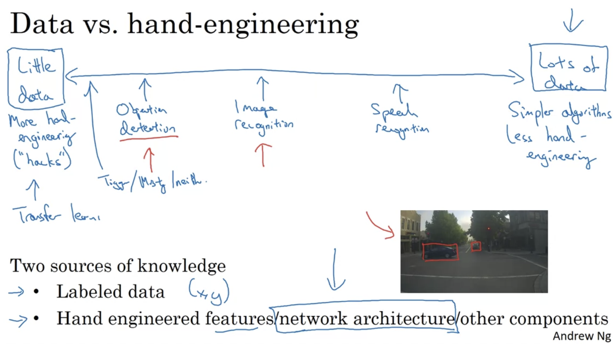

# Week 2

## 1. Case Studies

### a. Classic networks

+ LeNet-5
+ AlexNet
+ VGG

#### i. LeNet-5

  

#### ii. AlexNet

  

#### iii. VGG-16

  

### b. ResNets

#### i. Residual block

  

#### ii.Residual Network

"plain network"

  

#### iii. Why ResNets work

Identity function is easy for Residual block to learn -> will not hurt the performance 

  

#### iv. Image

  

### c. 1X1 Convolutions

Network in network

  

Shrink networks

  

### d. Inception Network

#### i. Motivation

  

+ The problem of computational cost
+ Different structure: using 1X1 convolution -> bottleneck layer

  
  

#### ii. Inception Network

  
  

Paper还cite了inception

  

### e. MobileNets

#### i. Motivation

Designed for low compute environment

  

#### ii. Comparison

Normal Conv

  

Depthwise Separable Conv

+ filter每层对应每层：红对红，绿对绿，蓝对蓝
+ 最终得到一个intermediate value

  

Pointwise Conv：DSC的下一步

  

#### iii. Cost summary

  

#### iv. Architecture

MobileNet v1 vs. MobileNet v2

  

Expansion -> Depthwise -> Pointwise (projection)

  

### f. EfficientNet

Motivation: Scale a particular network up/down

Ways to change scale:

+ Higher resolution image
+ Deeper
+ Wider
+ Compound scaling（前三个合并一起改变）

  
  
  
  

## 2. Advices for Using Conv

### a. Transfer Learning

Use pre-trained parameters (imageNet, coco, ...)

#### i. Small training set：
+ Method 1（蓝色）
  1. Freeze parameters of layers
  2. Change softmax layer (depends on real problems)
+ Method 2（紫色）
  1. 将input放入pre-trained model，得到output
  2. 对output搭建一个shallow network

  

#### ii. Larger training set：
1. Freeze some layers
2. Train others

  

#### iii. Lots of data:
1. 用开源神经网络的权重作为初始值（replace随机值初始化）
2. 重新训练整个网络

  

### b. Data Augmentation

#### i. Common Augmentation Methods

+ Mirroring
+ Random cropping
+ Rotation
+ Shearing
+ Local warping

  

#### ii. Color Shifting

PCA color augmentation -> 如果图片主要是紫色（红+蓝），那么这个算法会对红色和蓝色的改变多，绿色相对少

  

#### iii. Implementation

Can be done in parallel
+ One thread: loading data and augmenting
+ The other thread: training

  

### c. Computer Vision

#### i. Introduction

  

#### ii. Tips

  

