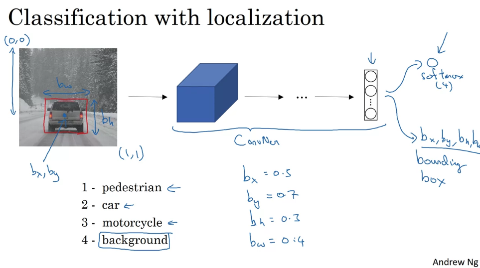
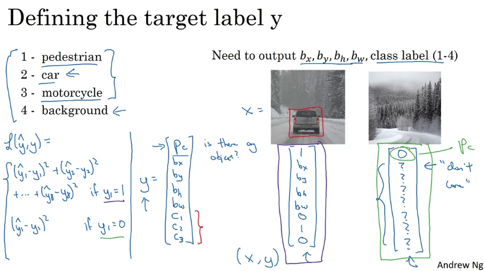
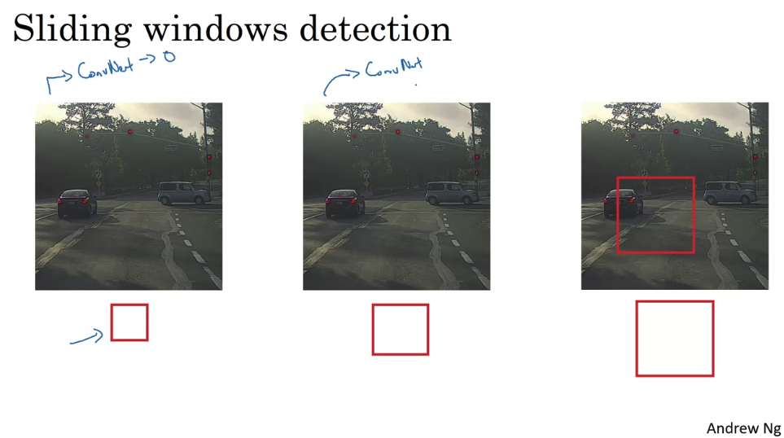
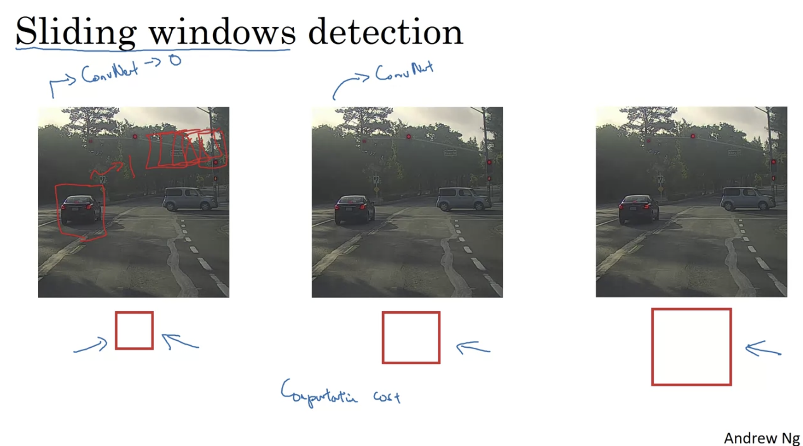
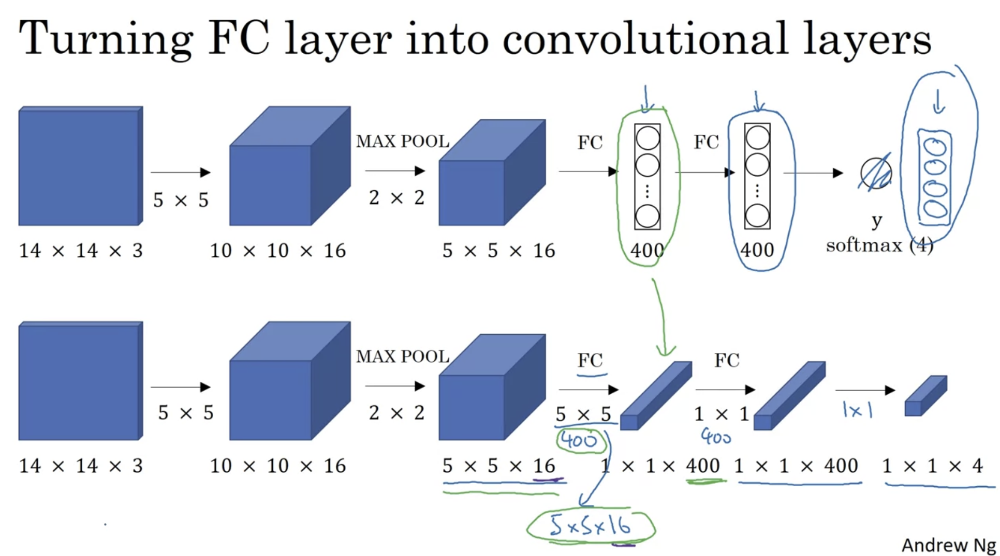
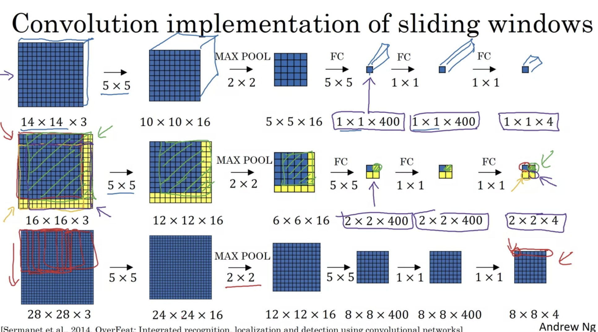
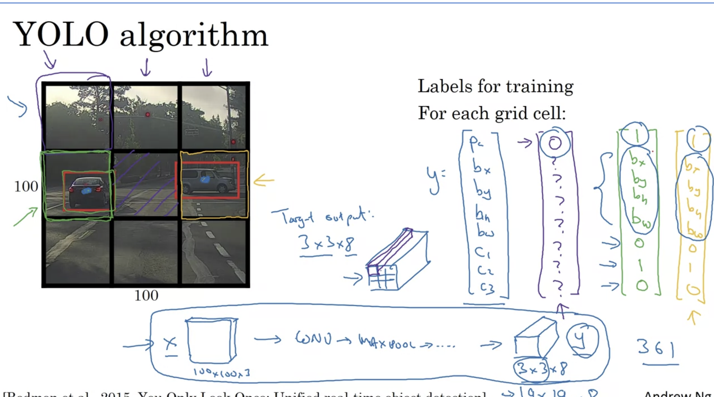
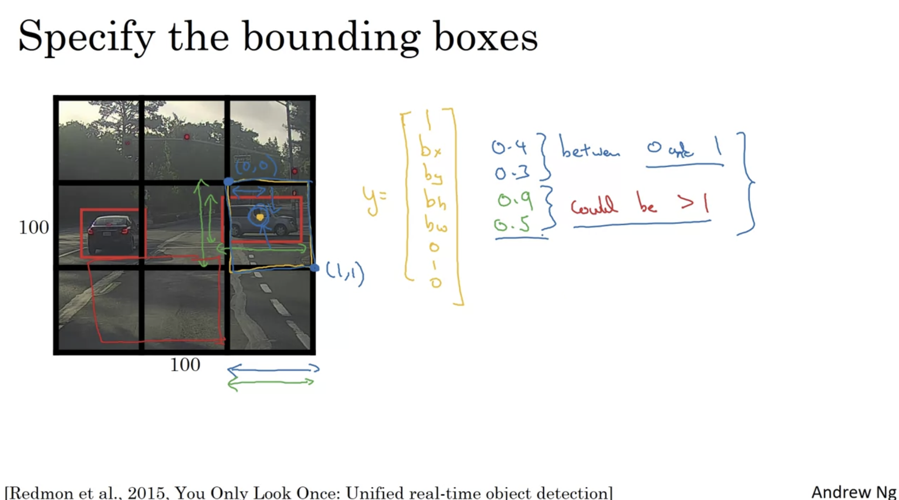

# Week 3

## 1. Detection Algorithm

### a. Object Localization

Classification with Localization

  

Defining the target label y

  

### b. Landmark Detection

标记点，每个点的位置作为ground truth

  

### c. Object Detection

#### i. Sliding windows detection

小方块一步一步找，然后将size变大 -> Computational cost太大

  

#### ii. Turning FC to Conv layers

  

#### iii. Conv implementation of sliding windows

  

#### iv. Bounding Box Algorithm

YOLO algorithm：将一张图平等分为nxn大小，然后对每个部分prediction得到一个output

  
  

