# Week 3

## 1. Detection Algorithm

### a. Object Localization

Classification with Localization

  

Defining the target label y

  

### b. Landmark Detection

标记点，每个点的位置作为ground truth

  

### c. Object Detection

#### i. Sliding windows detection

小方块一步一步找，然后将size变大 -> Computational cost太大

  

#### ii. Turning FC to Conv layers

  

#### iii. Conv implementation of sliding windows

  

### d. Bounding Box Algorithm

YOLO algorithm：将一张图平等分为nxn大小，然后对每个部分prediction得到一个output

  
  

### e. Intersection with Union

Motivation：检验检测效果如何 -> 比率

  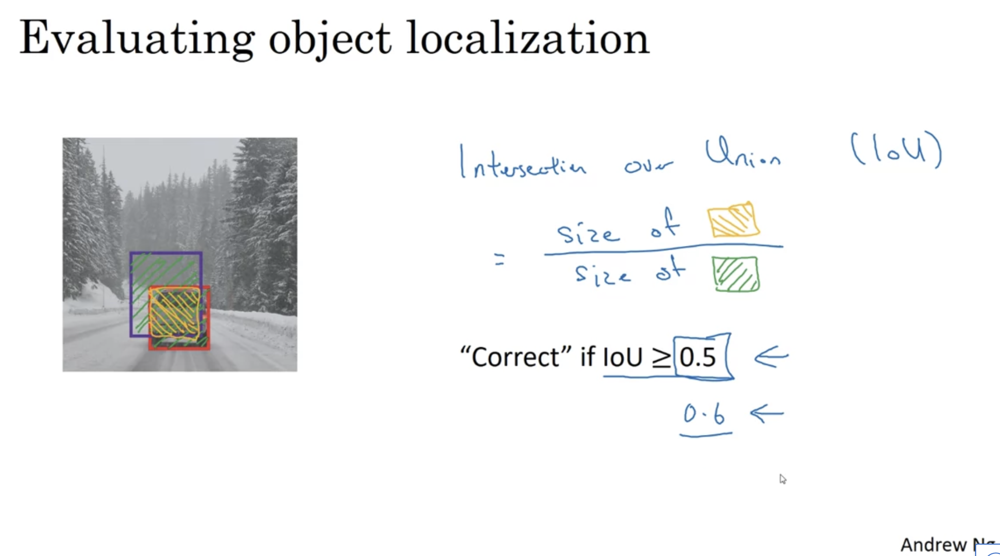

### f. Non-max Suppression

Motivation：判断是否算法对同一目标有多次检测 -> 几个选中的目标中选择概率最高的

  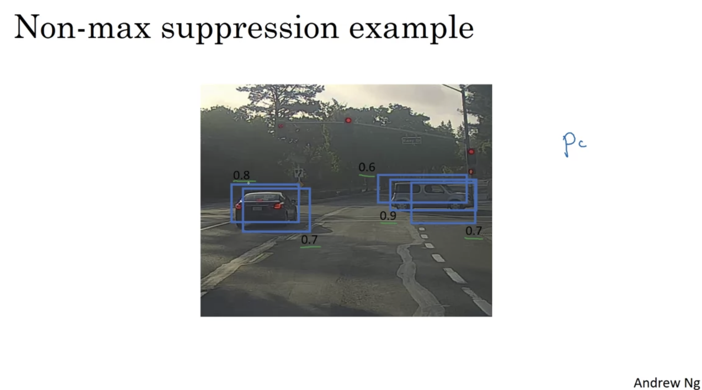
  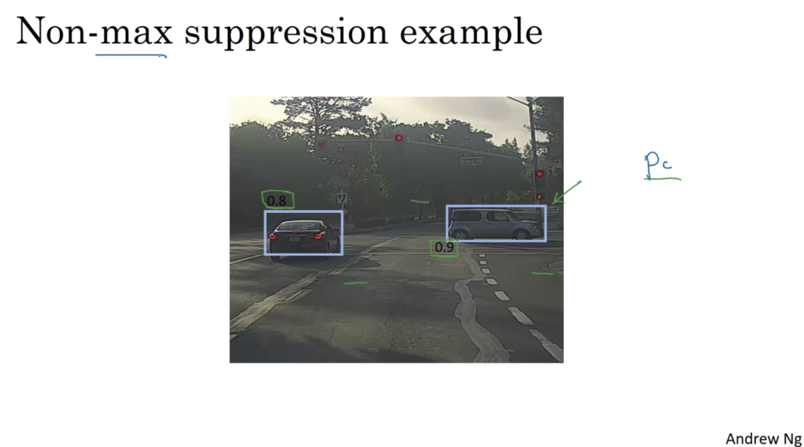

Implement：

  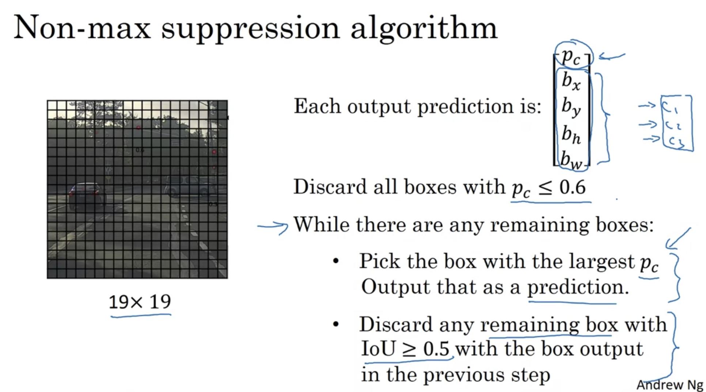

### g. Anchor Box

Motivation：detect multiple objects

  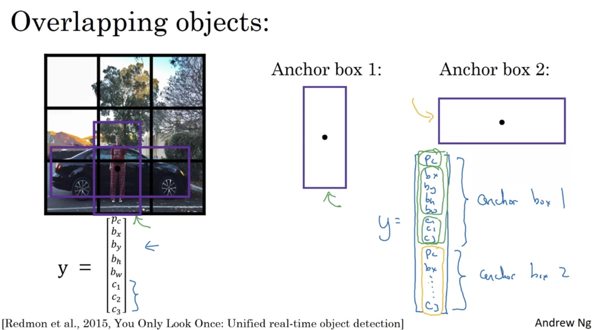

Implement

  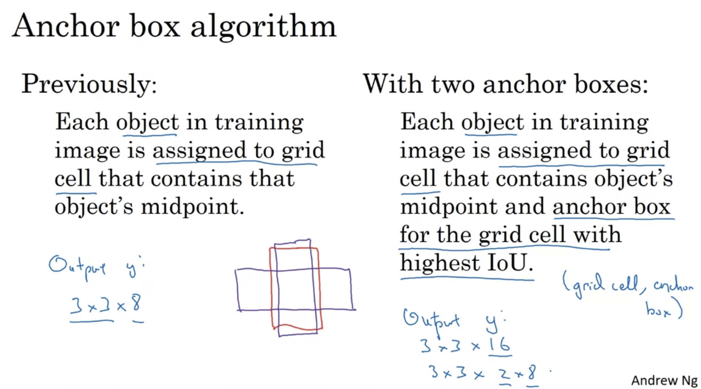

Example

  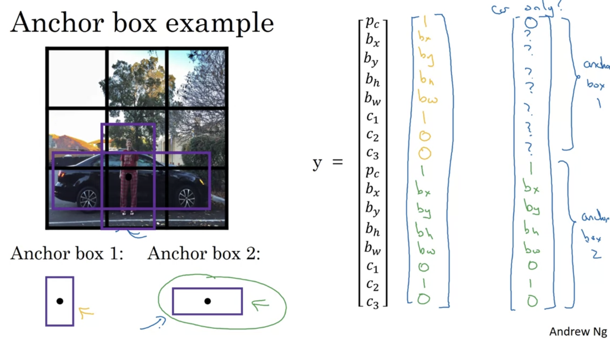

### h. YOLO Algorithm

Training

  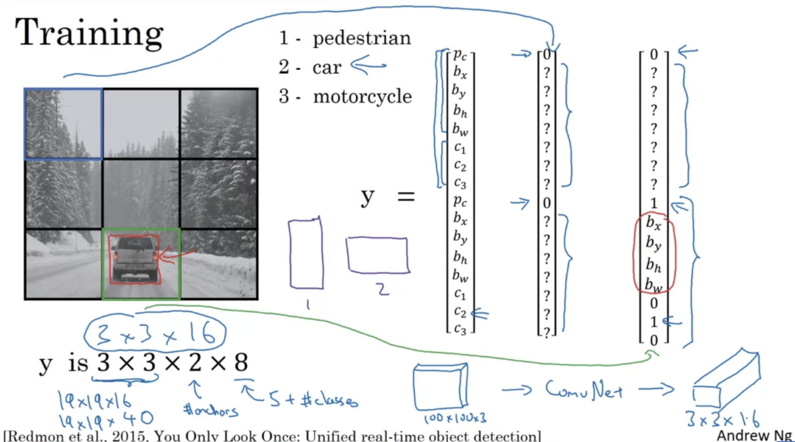

Making predictions

  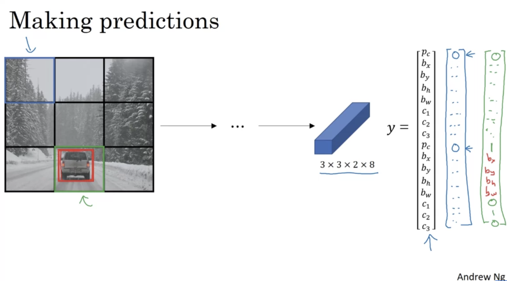

Outputting the non-max suppressed outputs

  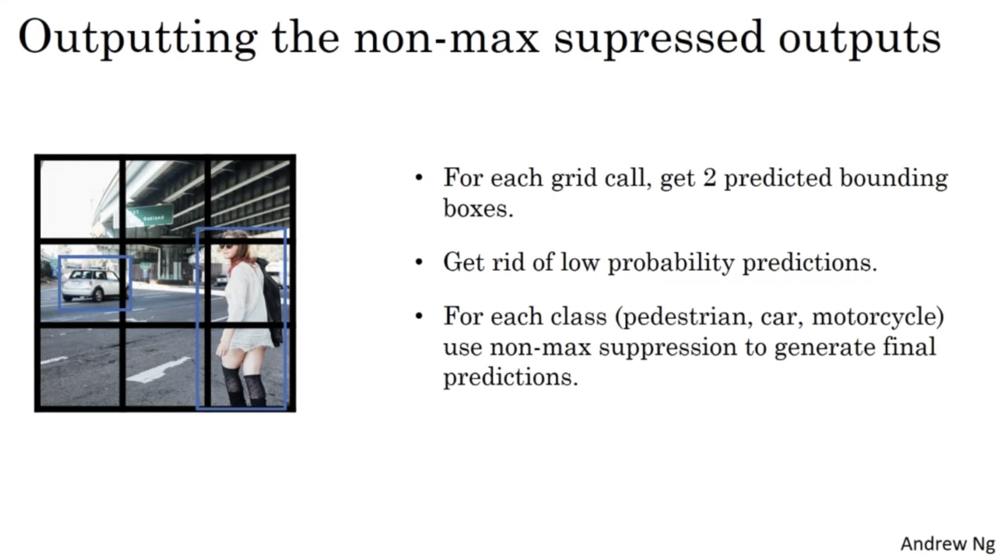

### i. Region Proposol

Procedure：将图片变成最右边的样式，然后对每个色块来运行YOLO（是一种segment algorithm）

  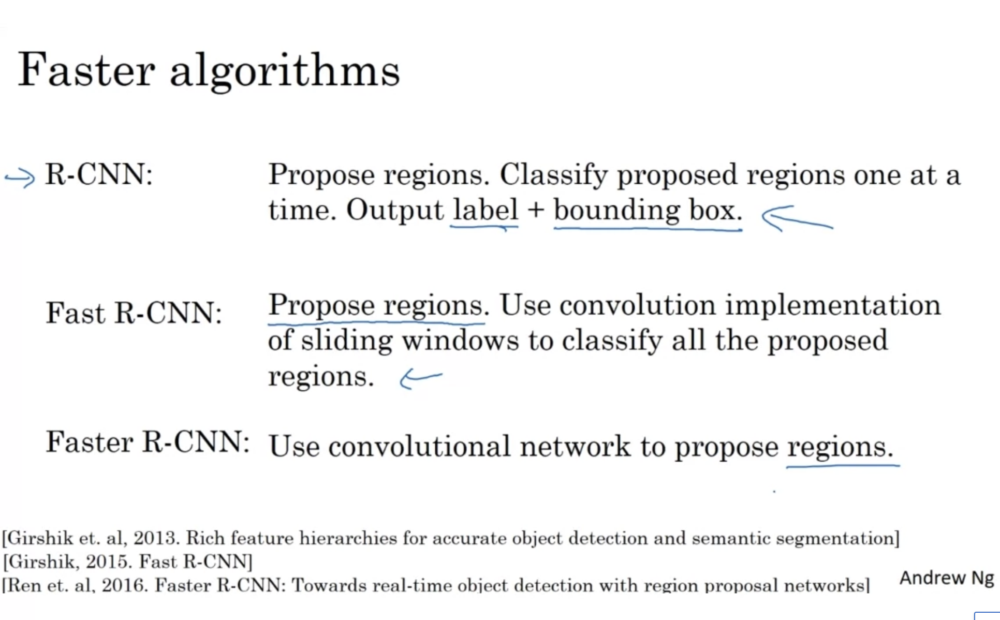

### j. Semantic Segementation

  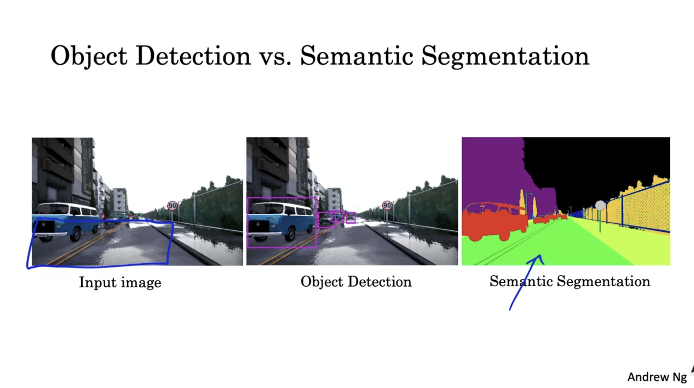
  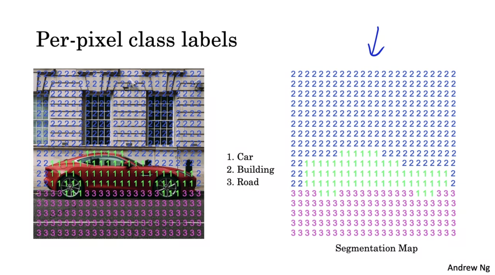

Deep learning architure for semantic segementation

  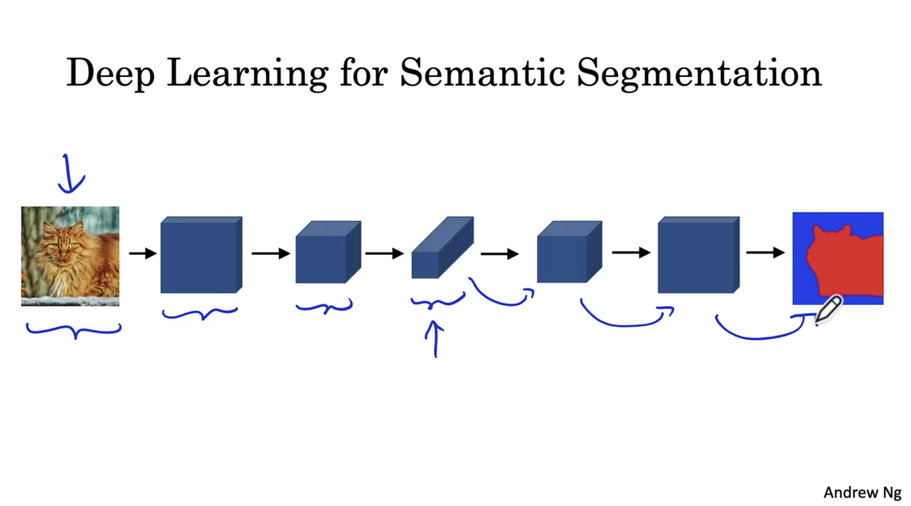

