# Week 4

## 1. Face Recognition

### a. Introduction

  

### b. One-shot Learning

单样本学习问题 -> 对于每个人脸，深度学习然后output是不现实的 -> 所以选择比较两张脸是否相似 -> Learning a similarity function

  

### c. Siamese Network

  
  

### c. Triplet Loss

Objective

  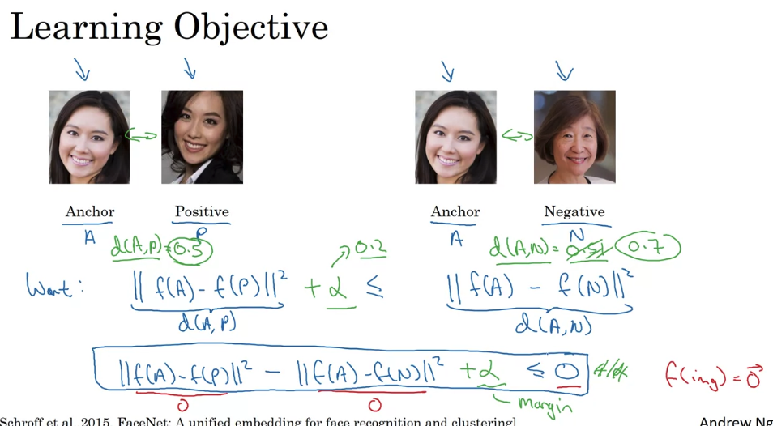

Loss function

  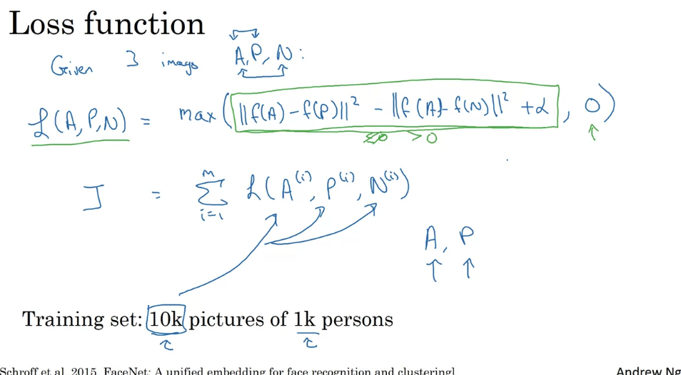
  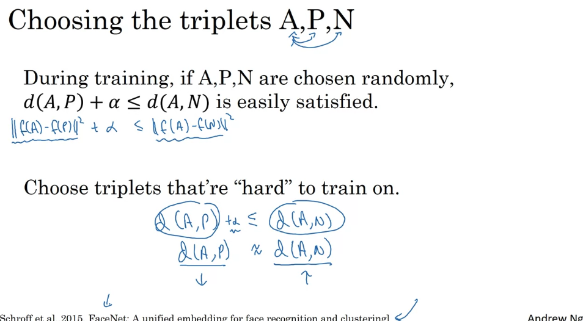

### d. Binary Classification

Using different pairs to train a nerual network -> Same, y = 1; different, y = 0

  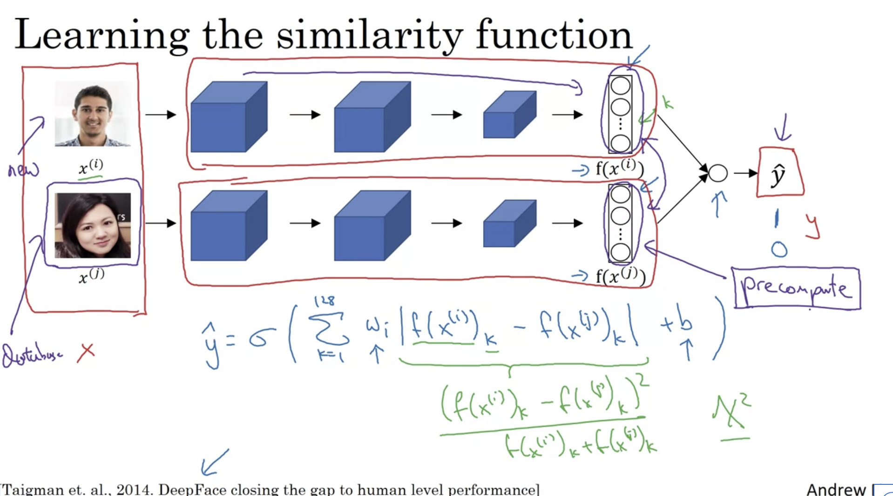

## 2. Neural Style Transfer

### a. Visualization of CNN

图片detect的物体是在逐渐变复杂的：从pattern到真正的物体

  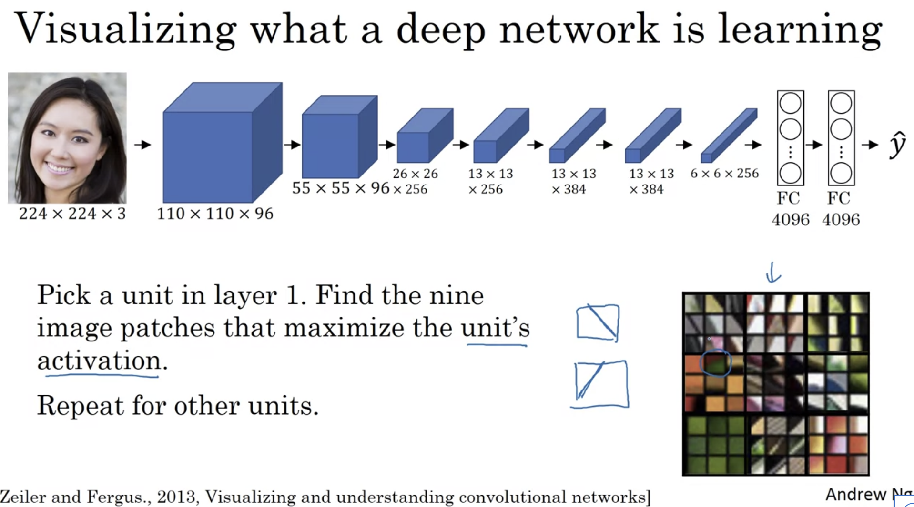
  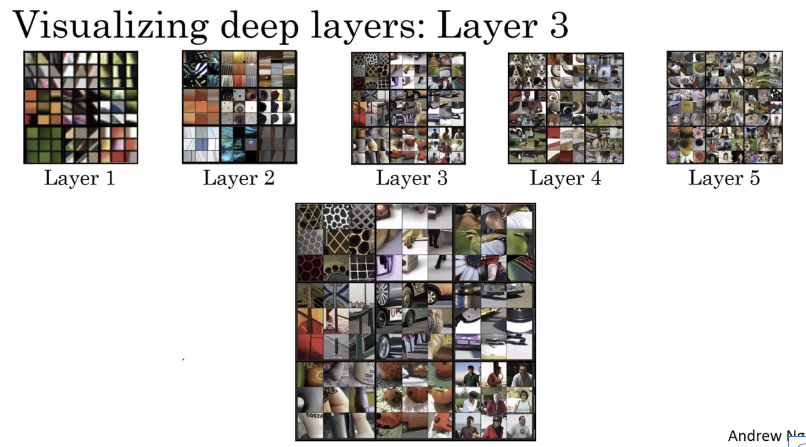

### b. Cost Function

#### i. Procedure

  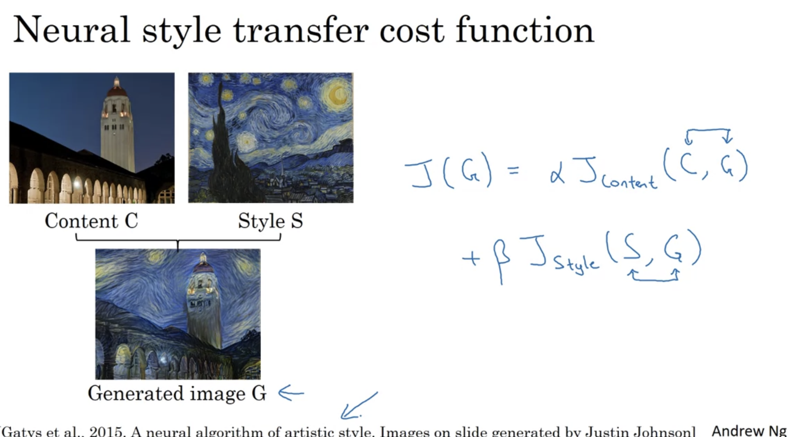
  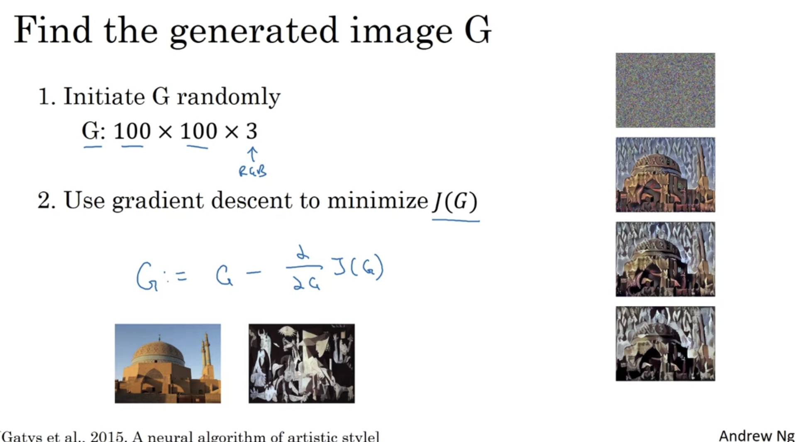

#### ii. Content Cost Function

  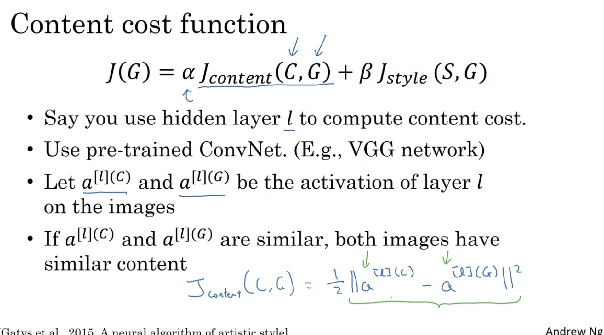

#### ii. Style Cost Function

  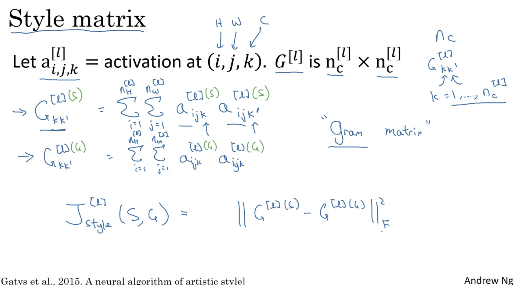
  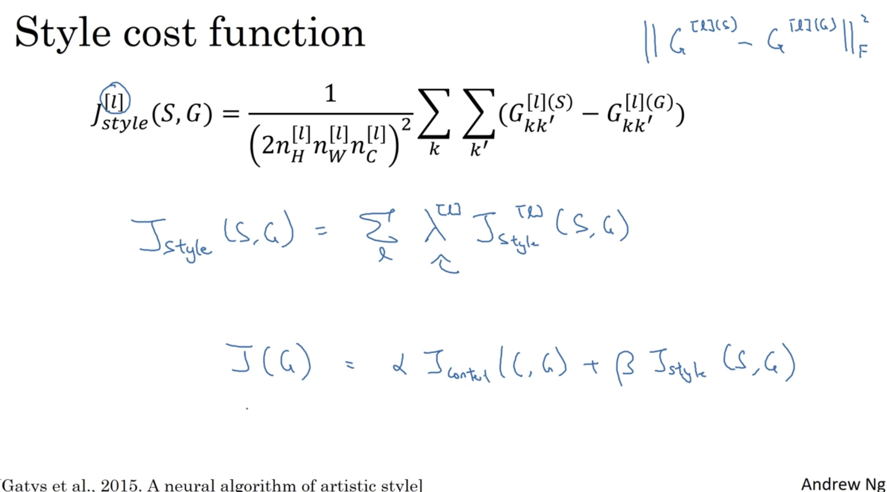

### c. Generalization for 1D and 3D

+ 1D & 3D examples
+ 3D可以是医学影像，也可以是电影（连续画面处理为3D）

  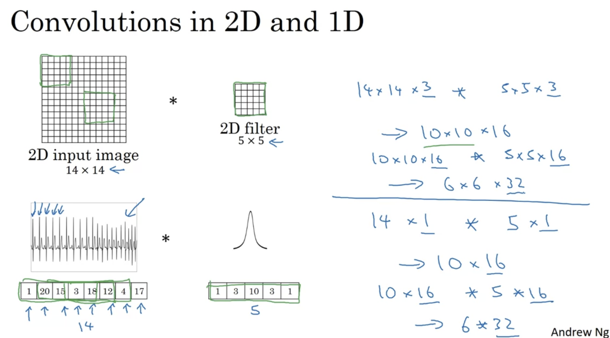
  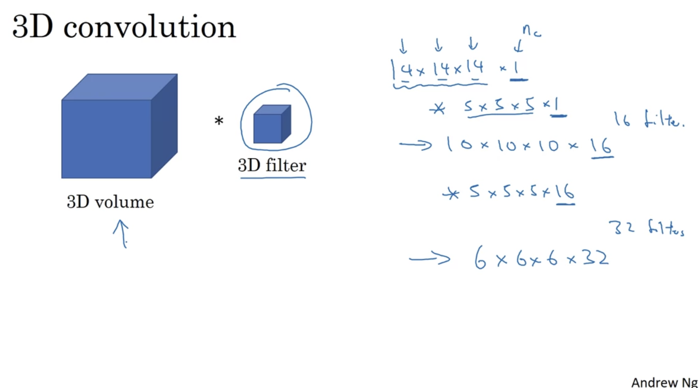

