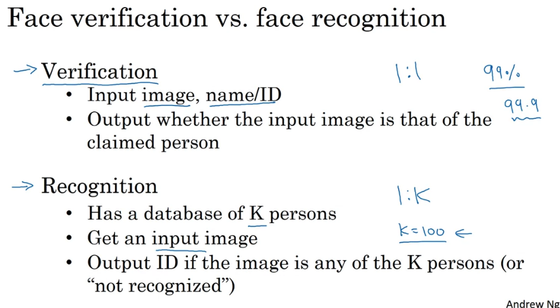
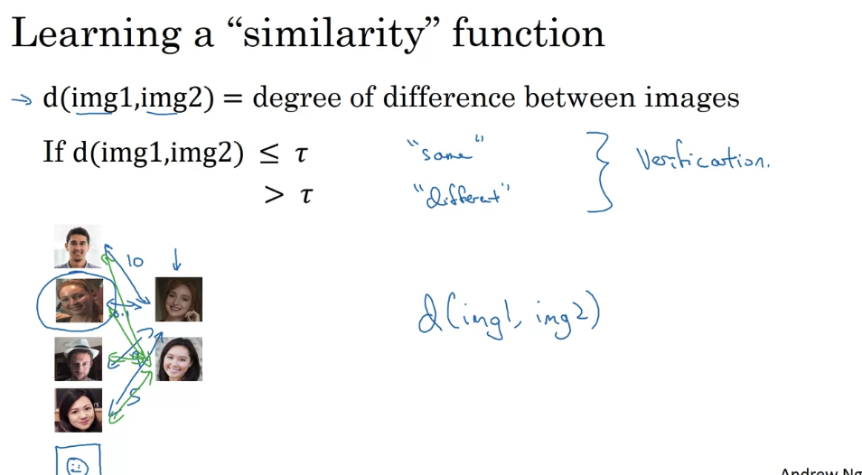
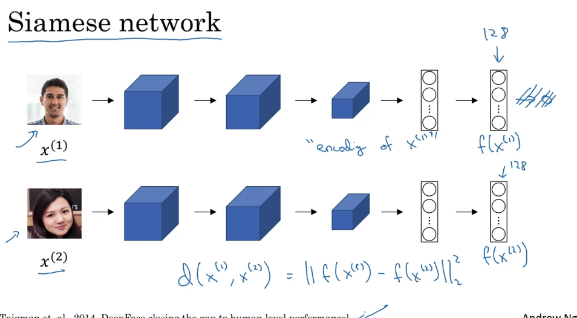
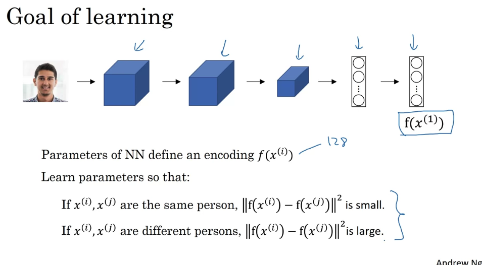

# Week 4

## 1. Face Recognition

### a. Introduction

  

### b. One-shot Learning

单样本学习问题 -> 对于每个人脸，深度学习然后output是不现实的 -> 所以选择比较两张脸是否相似 -> Learning a similarity function

  

### c. Siamese Network

  
  

### c. Triplet Loss
