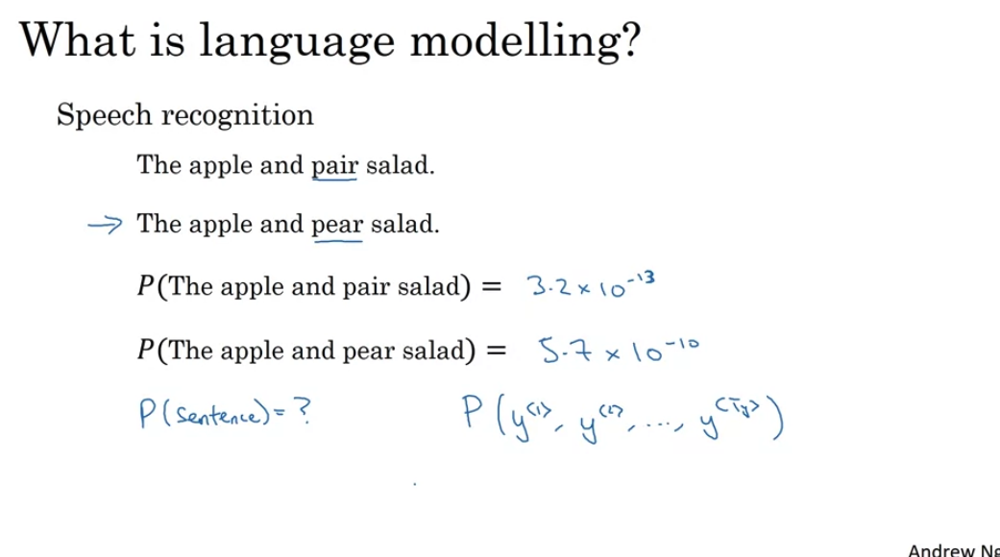

# Week 1

## 1. RNN

### a. Introduction

Examples of sequence data

  

### b. Notations

T指的是input text（字符串）的长度

  

根据词典对input进行one-hot编码，然后让模型去output一个y

  

### c. Structure

  

#### i. Forward Propagation

  
  

#### ii. Backward Propagtion

  

### d. Different Types of RNN

+ One-one
+ Many-many
+ Many-one
+ One-many

  
  

Summary

  

### e. What Is Language Modeling?

  

EOS and UNK

  

output就是根据dict给出下个可能的单词的probability

  

### f. Sampling Novel Sequences

  

Character-level language model

  

### g. Vanishing Gradients with RNNs

Vanishing gradients with RNNs：output会被附近的output所影响，比如y3会被y2和y4影响，但是远距离的output很难被影响，比如last y很难被y1影响

  

### h. Gated Recurrent Unit (GRU)

RNN unit

  

GRU simplified

  

Full GRU

  

### i. LSTM

  

Picture

  

### j. Bidirectional RNN

Blocks can still be GRU/LSTM block

  

### k. Deep RNN

  

