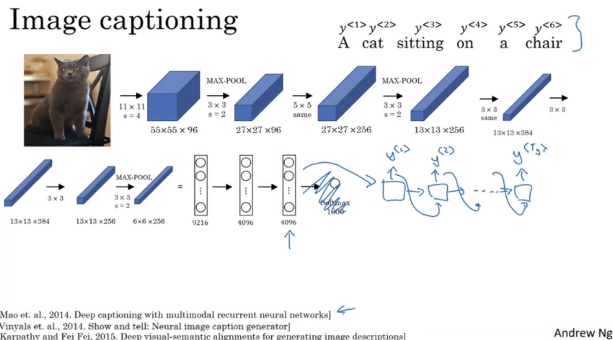
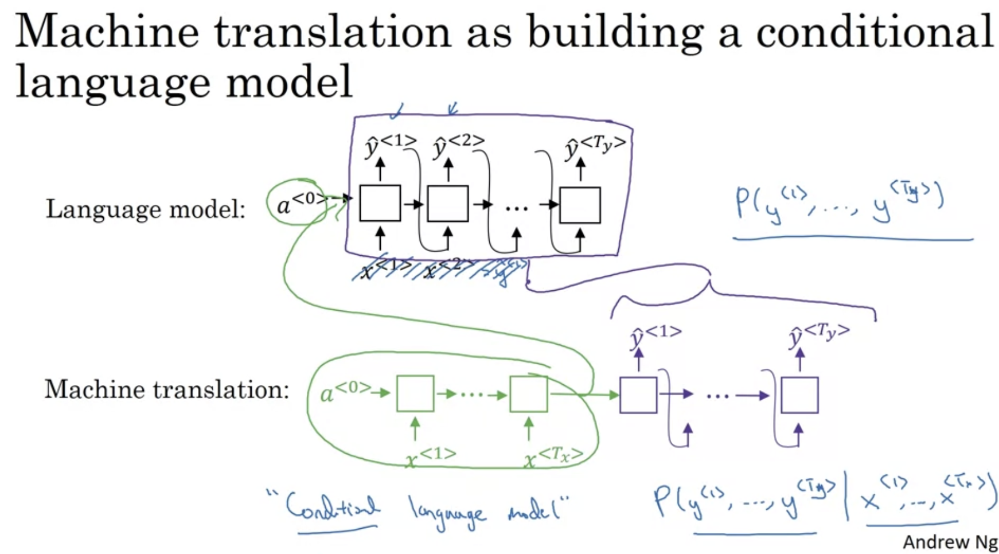
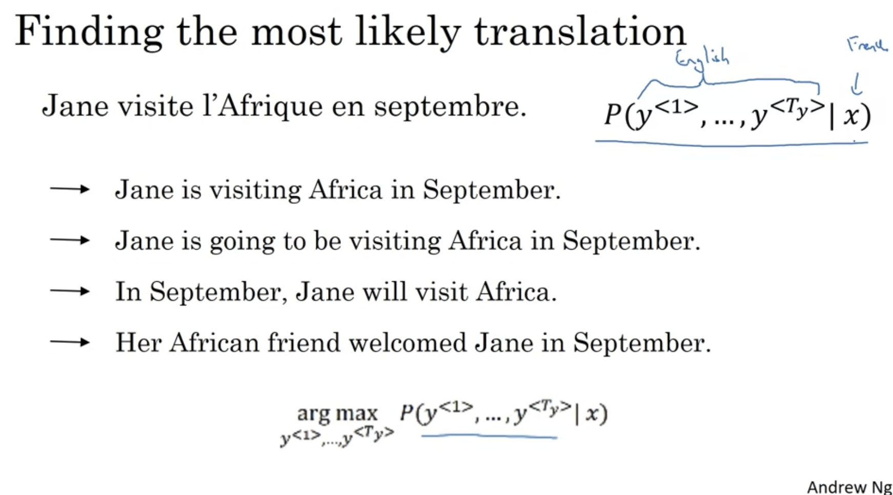
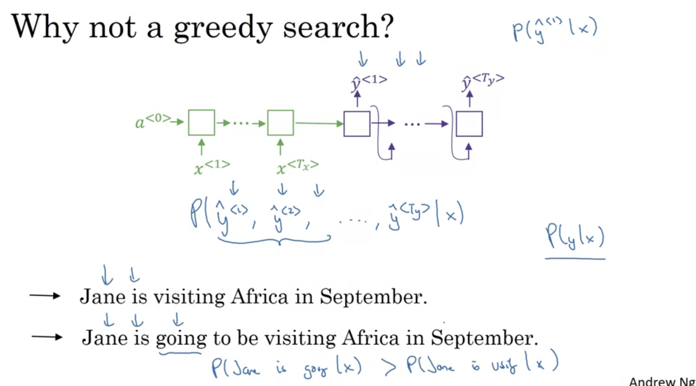
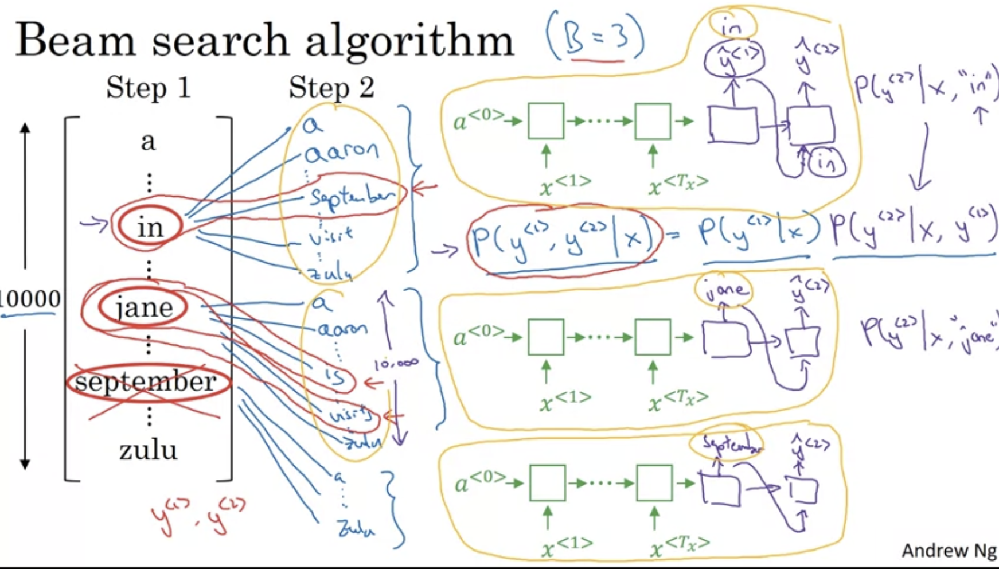
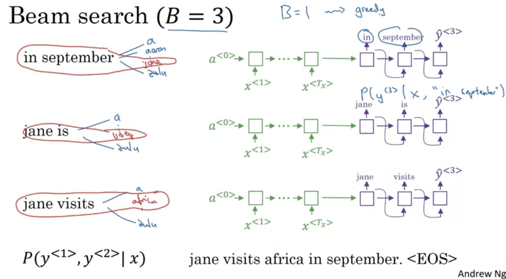
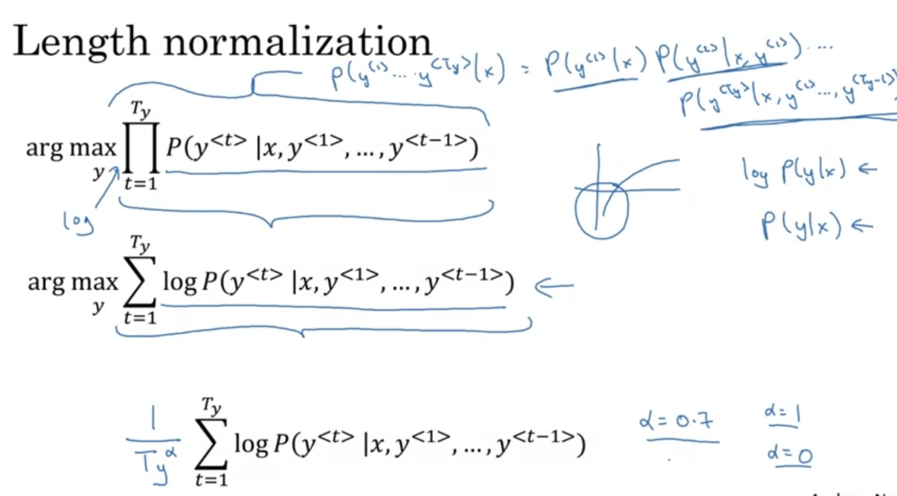
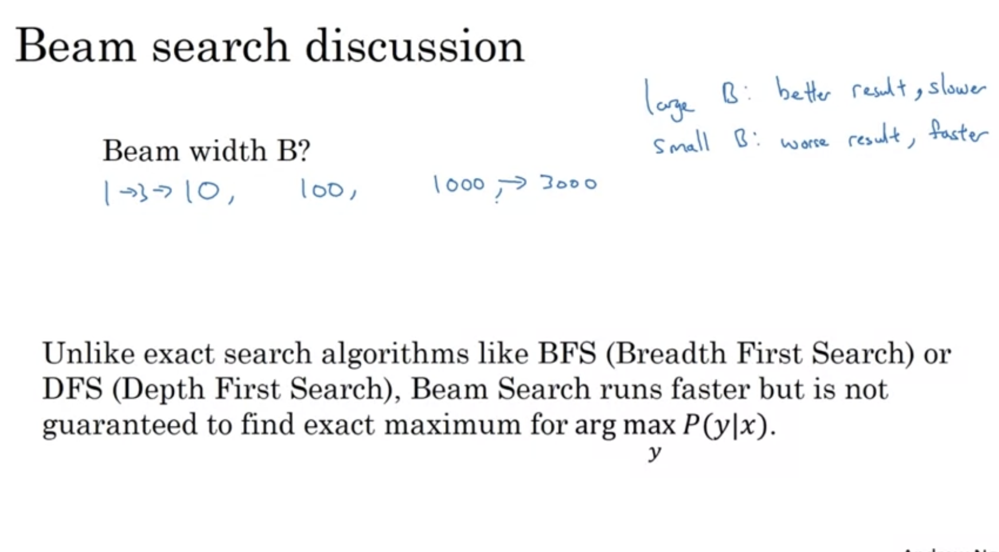
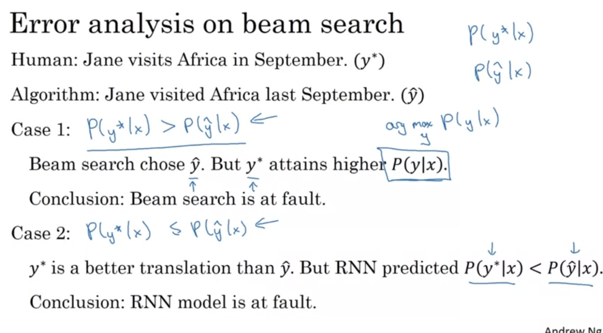
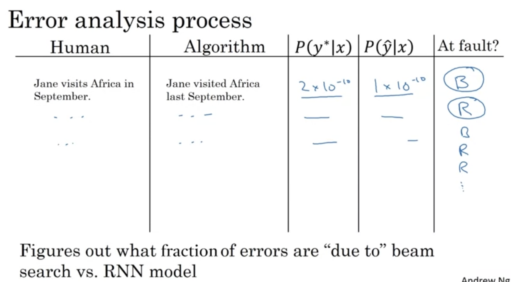

# Week 3

## 1. Sequence to Sequence Architectures

### a. Basic Models

  

### b. Beam Search

#### i. Motivation

给出一个given x（某种语言版本），得到y（翻译版本）的概率，而不是直接给出y的概率

  

结果是要寻找argmax（最大值），而不是randomly selected的

  

使用beam search而不是greedy search，why？
+ Greedy search：对于每一个y<1>，output可能性最大的那个
+ Greedy search可能达到局部最优解，但不可能达到全局最优

  

#### ii. Procedure

Beam search：
+ Step 1: output B个可能的words，
+ Step 2: 然后根据这三个words来找下一个可能的word，然后再找出可能行最大的B个pair
+ 如果 B = 1，那么beam search就和greedy search一样了

  
  

#### iii. Refinements to beam search

Length normalization：介于full normalization和null normalization中的一种，调整alpha的权重来获得更好的效果

  

#### iv. Disucssions

  

#### v. Error analysis

比较两个outputs的概率（真实值和预测值）

  

Logic: 如果是case 1，那么output有问题；如果是case 2，那么神经网络有问题

  

Procedure:

  

