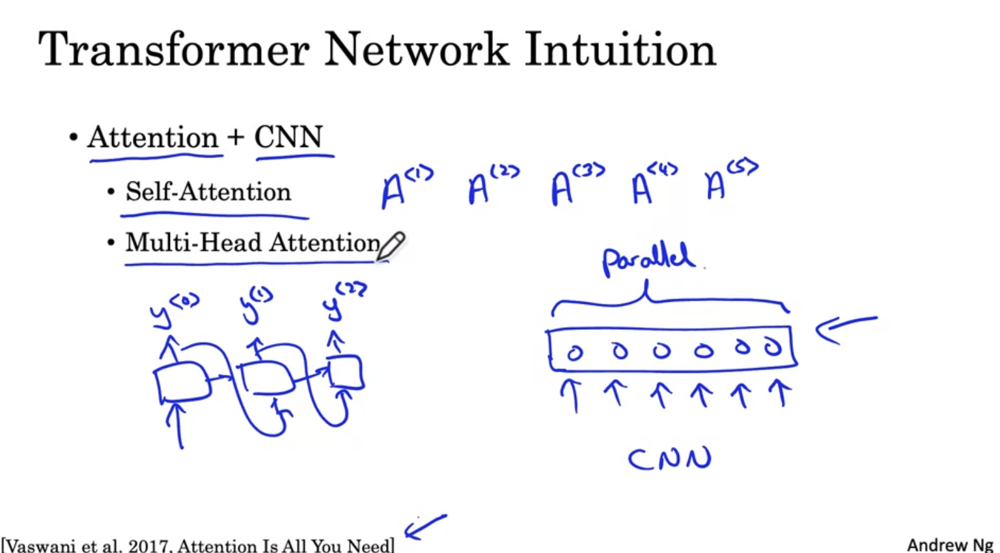
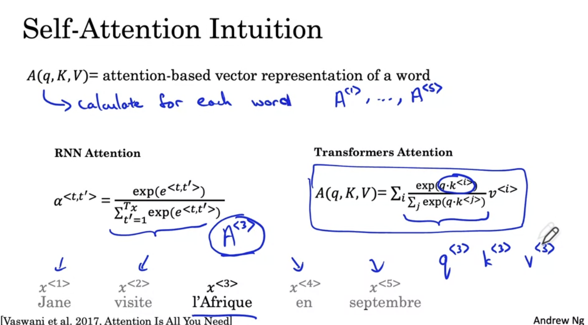
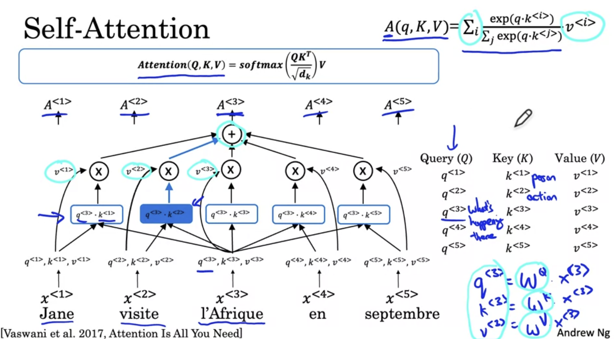
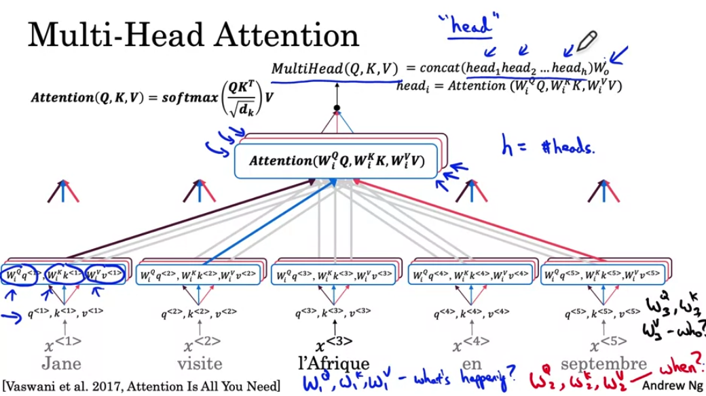
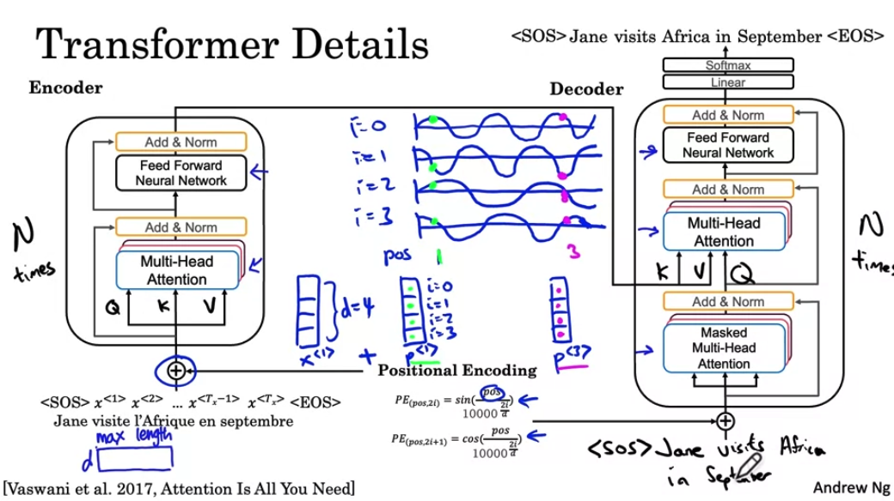

# Week 4

## 1. Transformers

### a. Intuition

  

### b. Self-Attention

+ Q - 对于单词提的question
+ K - 问题的答案
+ V - 这个情况应该怎么表示

  
  

### c. Multi-headed Attention

Big for-loop for self-atttention model: ask multiply questions at once

  

### d. Transformer Network

  

